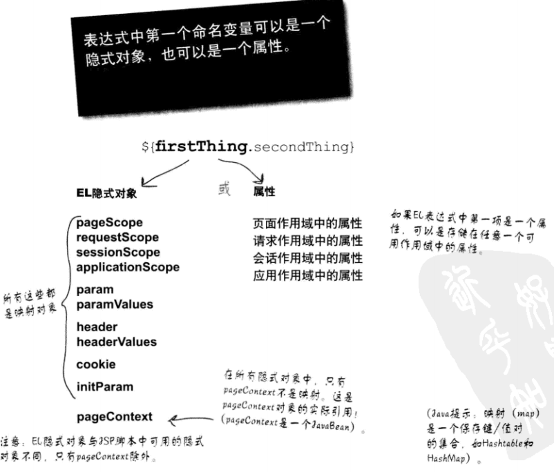
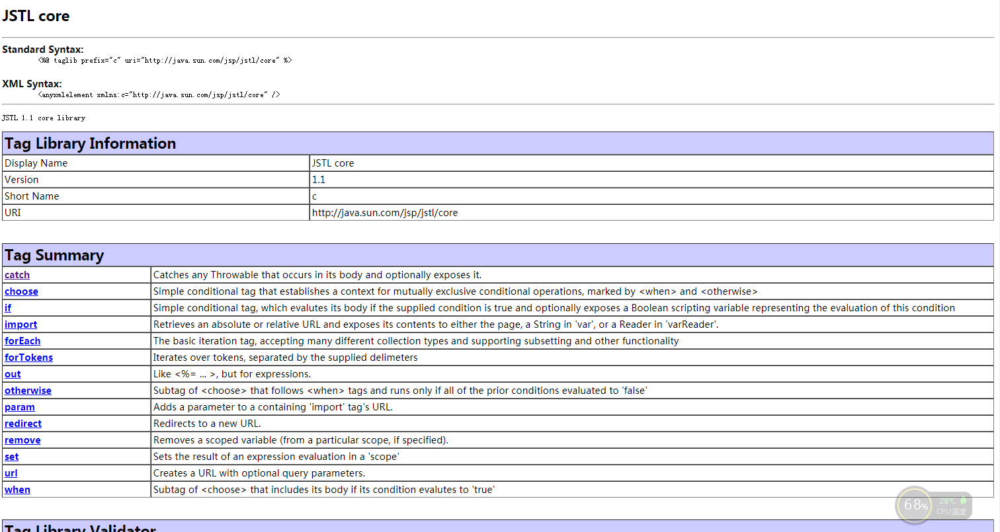
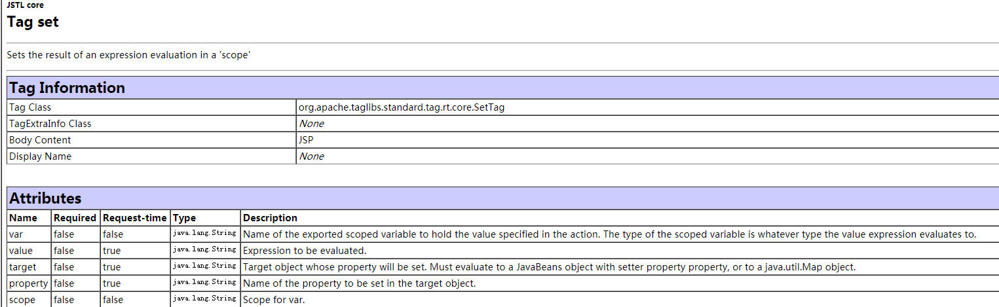
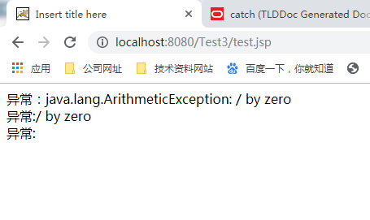
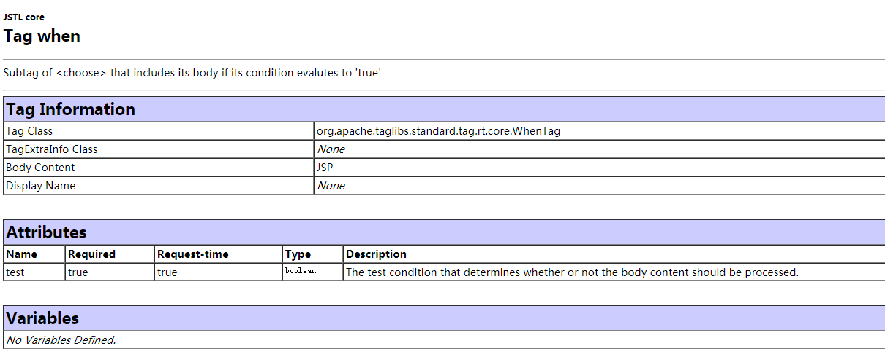
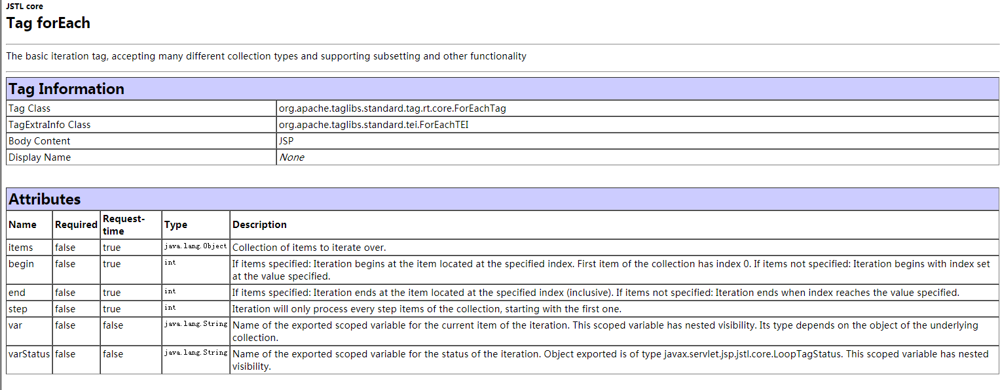
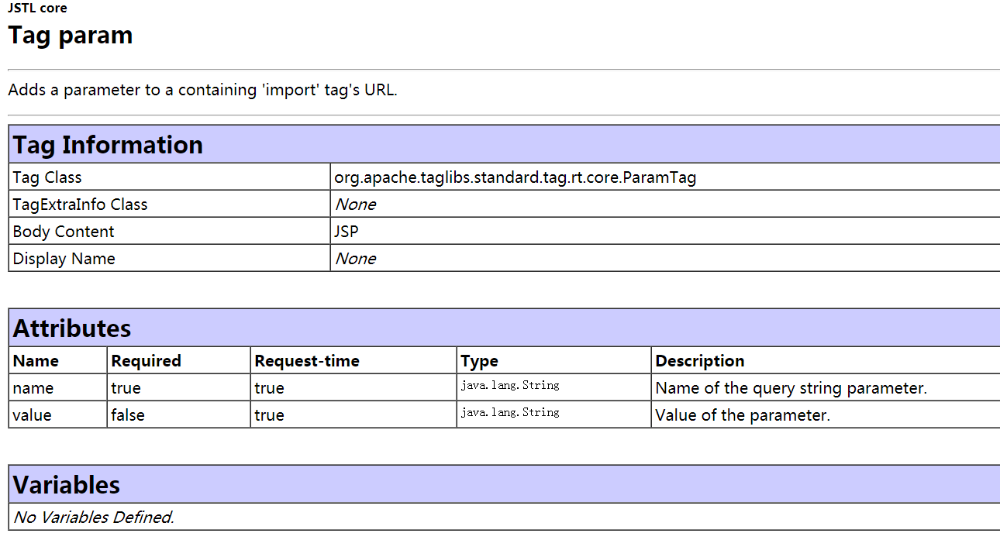
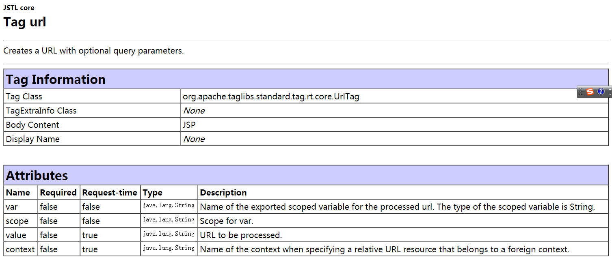
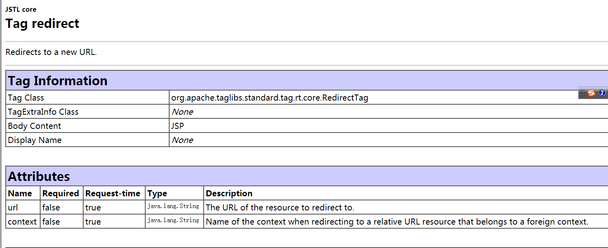
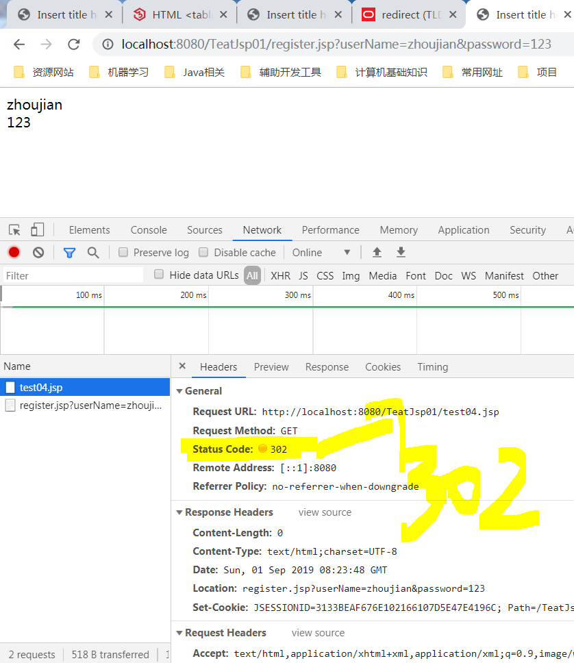

## 1、JSP表达式语言EL

在JSP开发中，为了获取Servlet域对象中存储的数据，经常需要书写很多Java代码，这样的做法会使得JSP页面混乱，难以维护。为此在JSP中提供了EL表达式。EL表达式是Expressionb Language的缩写，它是一种简单的数据访问语言。 

	EL表达式总是放在大括号里，而且前面有一个美元符前缀。
	
	${firstThing.secondThing}

* **点号左边的变量要么是一个Map（有键），要么是一个bean（有性质)**  
* **pageContext隐士对象是一个bean，它有获取方法，所以其他隐士对象都是Map**  
* **如果对象是一个bean，但是指定的性质不存在，会抛出一个异常。**  

### 1.1 EL语法

#### 1.1.1、EL中的变量

EL表达式中的变量就是一个基本存储单元，EL表达式可以将变量映射到一个对象上，具体示例如下:
	
	${product}

**在上述示例中，product就是一个变量。EL表达式中的变量不用事先定义就可以直接使用**  

#### 1.1.2、EL中的运算符

**1、点运算符(.)** 

**EL表达式中的点运算符，用于访问JSP页面中某些对象的属性，如JavaBean对象、List对象、Array对象等，其语法格式如下：** 
	
	${customer.name}
*在上面的语法格式中，表达式${customer.name}中的点运算符的作用就是访问customer对象中的name属性* 

**2、方括号运算符([])** 

**EL表达式中的方括号运算符与点运算符的功能相同，都用于访问JSP页面中某些对象的属性，当获取的属性名中包含一些特殊符号，如“-”或“？”等并非字母或数字的符号，就只能使用方括号运算符来访问该属性:** 
	    
 	${user["My-Name"]}

与点运算符的区别： 
	
* 点运算符和方括号运算符在某种情况下可以互换，如${student.name}等价于${user["name"]}  
* 方括号运算符和点运算符可以相互结合使用，例如，表达式 ${user[0].userName}  
* 方括号运算符还可以访问List集合或数组中指定索引的某个元素，如表达式 ${user[0]}用于访问集合或数组中第一个元素。  

**3、算数运算符** 
	
	${1-2 } 

	${1*2 } 
	
	${122+22 } 
	
	${10/4 } 

**4、比较运算符** 
	
	>  < == != <= >=

**5、逻辑运算符** 
	
	&&(and)  ||（or) 

**6、empty运算符** 

**EL表达式中的empty运算符用于判断某个对象是否为null或“”，结果为布尔类型**  
	
	${empty var}

### 1.2 EL隐士对象

隐含对象名称|描述
-|-|-
pageContext|对应于JSP页面中的pageContext对象
pageScope|代表page域中用于保存属性的Map对象
requestrScope|代表equest域中用于保存属性的Map对象
sesssionScope|代表session域中用于保存属性的Map对象
applicationScope|代表application域中用于保存属性的Map对象
param|表示了一个保存所有请求参数的Map对象
paramValues|表示一个保存了所有请求参数的Map对象，它对于某个请求参数，返回的是一个String类型的数组
header|表示保存了所有http请求头字段的Map对象
headerValues|表示了一个保存了所有http请求头字段的Map对象，返回String类型的数组
cookie|用来取得使用者的Cookie值，cookie的类型时Map
initParam|表示了一个保存所有Web应用初始化参数的Map对象

* **pageContext可以获取其他10个隐式对象，**  
* **pageScope、requestScope、sessionScope、applicationScope值是用于获取指定域的隐士对象**  
* **param和paramValues是用于获取请求参数的隐士对象，header和headerValues是用于获取HTTP请求消息头的隐士对象**  
* **cookie用于获取Cookie信息的隐士对象**  
* **initParam用于获取Web应用初始化信息的隐士对象** 

#### 1.2.1 pageContext对象
**为了获取JSP页面的隐士对象（注意区分JSP页面的隐式对象与EL表达式的隐式对象），可以使用EL表达式中的pageContext隐式对象。**  

可以利用EL表达式中的pageContext对象获取JSP中的隐式对象。 

	
	<!-- 使用pageContext对象获取request对象 -->
	${pageContext.request.characterEncoding } 
			
	<!-- 使用pageContext对象获取response对象 -->
	${pageContext.response.contentType } 
	
	<!-- 使用pageContext对象获取ServletContext对象 -->
	${pageContext.servletContext.serverInfo } 
	
    <!-- 使用pageContext对象获取ServletConfig对象 -->
	${pageContext.servletConfig.servletName } 

#### 1.2.2 Web域相关对象
**在Web开发中，pageContext、HttpServletRequest、HttpSession和ServletContext这4个对象之所以能存储数据，是因为他们内部都定义了一个Map集合，这些Map集合是有一定作用范围的，例如HttpRequest对象存储的数据只能在当前请求中可以获取到。习惯性的，我们把这些Map集合称为域，这些Map集合所在的对象称为域对象。在EL表达式中，为了获取指定域的数据，提供了pageScope、requestScope、SessionScope和applicationScope**	   
**这些所谓scope就是Map对象**  
**需要注意的是，EL表达式只能在这4个作用域中获取数据**   

		<% request.setAttribute("userName", "1"); %>
	<%session.setAttribute("userName", "2"); %>
	<%pageContext.setAttribute("userName", "3"); %>
	<% application.setAttribute("userName", "4"); %>
	
	表达式\${pageScope.userName }的值为 ${pageScope.userName } 
	表达式\${requestScope.userName }的值为 ${requestScope.userName } 
	表达式\${sessionScope.userName }的值为 ${sessionScope.userName  } 
	表达式\${applicationScope.userName }的值为 ${applicationScope.userName  } 
	

**需要注意的是，使用EL表达式获取某个域对象的属性时，可以不使用这些隐式对象来指定查找域，而是直接饮用域中的属性名称即可，例如表达式${userName}就是在page、request、session、application这四个作用域内依次查找userName属性**  

 测试属性的保存于传递与使用  

 1、在Servlet中处理请求数据，并对一些数据进行保存，转发，存储在数值域中。方便在EL表达式中使用  

	package com.monkey.servlet;
	
	import java.io.IOException;
	
	import javax.servlet.ServletException;
	import javax.servlet.annotation.WebServlet;
	import javax.servlet.http.HttpServlet;
	import javax.servlet.http.HttpServletRequest;
	import javax.servlet.http.HttpServletResponse;
	
	import com.bean.Dog;
	import com.bean.Person;
	
	public class TestServlet extends HttpServlet {

	@Override
	protected void doGet(HttpServletRequest req, HttpServletResponse resp) throws ServletException, IOException {
		
	
		
		//设置request requestScope
		req.setAttribute("name", "zhoujian");
		
		//设置session属性 sessionScope
		req.getSession().setAttribute("password", "123");
		
		//设置application属性(EL表达式) applicationScope
		req.getServletContext().setAttribute("quanwen", "shujuku");
		
		//设置pageScope
		req.getRequestDispatcher("/Testel.jsp").forward(req, resp);
		
		
	}

 2、在JSP页面的EL表达式中获取数据并进行页面的展示 
	
		获取属性 
	
	request中存储的属性：${requestScope.name} 
	
	session中存储的属性: ${sessionScope.password } 
	
	applicationScope(ServletContex)中存储的属性：${applicationScope.quanwen } 
	
 3、页面 

#### 1.2.3、param和paramValues对象
**在JSP页面中，经常需要获取客户端传递的请求参数，为此，EL表达式提供了param和paramValues两个隐式对象，这两个隐式对象专门用于获取客户端访问JSP页面时传递的请求参数**  

**1、param对象**  
param对象用于获取请求参数中的某个值，它是Map类型，与request.getParameter()方法等价，在使用EL获取参数时，如果参数不存在，返回的是空的字符串
		
    ${param.num}

**2、paramValues对象***  
如果一个请求参数有多个值，可以使用paramVales对象来获取请求参数的所有值，该对象用于返回请求参数所有值组成的数组。
	
	${paramValues.num}

#### 1.2.4、header和headerValues对象
 
**（1）header对象** 
header对象用于获取请求头字段中某个值
	
	${header["user-agent"]}

#### 1.2.5、Cookie对象 

在JSP开发中，经常需要获取客户端的Cookie信息，为此，在EL表达式中，提供了Cookie的隐式对象，该对象是一个代表所有Cookie信息的Map集合，Map集合中元素的键为各个Cookie的名称，值则为对应的Cookie对象 

		获取cookie对象的信息：${cookie.userName}

		获取cookie对象的名称：${cookie.userName.name}

		获取cookie对象的值:${cookie.userNAME。vaule}

#### 1.2.6 initParam对象

在开发一个Web应用程序时，通常会在web.xml文件中配置一些初始化参数，为了方便获取这些参数，EL表达式提供了initParam隐式对象，该对象可以获取Web应用程序中全局初始化参数，具体示例如下:
		
		${initParam.count}

### 1.3 自定义EL函数

**EL表达式简化了JSP页面的书写，使不懂Java编程的开发人员也可以编写工能够强大的JSP页面。但EL本身的功能毕竟有限，例如，对于循环语句，EL表达式是很难实现的。因此，EL表达式允许用户自定义EL函数。** 

#### 1.3.1HTML注入

	解决在页面中编写 <  >这种HYML代码的问题。

##2、JSP标准标签库（用标签替代Java语言）

在JSP中可以通过Java代码来获取信息，但是过多的Java代码会使得JSP页面非常复杂。为此，Sun公司制定了一套标准标签库JSTL.  

### 2.1JSTL入门
#### 2.1.1什么是JSTL
从JSP1.1规范开始，JSP就支持使用自定义标签，使用自定义标签大大降低了JSP页面的复杂度。同时增强了代码的重用性，为此许多Web厂商都定制了自身应用的标签库，然而同一功能的标签由不同的Web应用厂商指定可能是不同的，这就导致市面上出现了很多功能相同的标签。为了解决这个问题，Sun公司制订了一套标准标签库（Java Server Pages Standard Tag Library)，简称JSTL.

	在JSTL1.1规范中，有5个标准的标签库。

**首先需要导入相关的jar包**  s
**在Eclipse中导入相关jar包之后的目录如下：**  

**使用**  

	<%@ page language="java" contentType="text/html; charset=ISO-8859-1"
    pageEncoding="ISO-8859-1"%>

	//使用taglib指令导入core标签库，uri属性用于指定引入标签库描述符文件的URI,prefix属性用于指定引入标签库描述文件的前缀
	<%@ taglib prefix="c" uri="http://java.sun.com/jsp/jstl/core" %>

	<!DOCTYPE html PUBLIC "-//W3C//DTD HTML 4.01 Transitional//EN" "http://www.w3.org/TR/html4/loose.dtd">
	<html>
	<head>
	<meta http-equiv="Content-Type" content="text/html; charset=ISO-8859-1">
	<title>Insert title here</title>
	</head>
	<body>
		
		<c:out value="HellowoRS"></c:out>
		
	</body>
	</html>

### 2.2、JSTL中的Core标签库

#### 2.2.1、<c:out>标签：想页面输出一段内容

语法1： 

	<c:out value="value" [default=""] [escapeXml="{true|false}"/>

语法2： 
	
		<c:out value="value"  [escapeXml="{true|false}"]      defaultValue </c:out>

* value:用于指定输出的文本内容
* default:用于指定当value属性为null时所输出的默认值
* escapeXml:用于指定是否将> ,<,&,"、“,等特殊字符进行HTML编码转换后再进行输出，默认值是true.
	
		
		<!-- 注意EL表达式结合JSTL标签shiyon -->
		<c:out value="${param.username}" default="unkown"></c:out> 
		
		<c:out value="${param.username}" >unkown</c:out> 

#### 2.2.2 <c:set>标签:Sets the result of an expression evaluation in a 'scope'

* value:设置属性的值

* var:指定要设置域对象属性的名称
* scope:属性所在域对象

* target:用于指定要设置属性的对象，这个对象必须是JavaBean对象或者Map对象
* property:指定要为当前对象设置的属性名称

**(1)使用<c:set>标签设置域对象中某个属性的值**

		<!--获取请求request中的参数并进行设置 -->
		<c:set var="userName" scope="request" value="${param.userName} "></c:set>
		<!-- 输出设置参数  注意EL表达式通常放在value属性中 -->
		<c:out value="${userName}"/>

**(1)使用<c:set>标签设置UserBean对象和Map对象中某个属性的值**

	   <!-- 使用<c:set>标签设置JavaBean 对象和Map对象 -->
	<!-- 首先生成或获取一个Java对象 -->
	<jsp:useBean id="user" class="com.monkey.bean.User" scope="page"></jsp:useBean>
	
	<!-- 使用<c:set>标签设置属性 -->
	<c:set target="${user}" property="userName" value="zhoujian"/>
	<c:set target="${user}" property="passWord" value="123"/>
	
	<c:out value="${user.userName} "></c:out>
	<c:out value="${user.passWord }"></c:out>
	
	
	<!-- 定义一个Map集合，并将其绑定给request对象 -->
	<% HashMap<String,String> map = new HashMap<>();
		request.setAttribute("preference", map);
	%>
	
	<!-- 通过target属性将Map集合指定为要设置属性的对象    -->
	<c:set target="${preference}" property="color" value="green" ></c:set>
	
	<c:out value="${preference.color} "></c:out>
--------------------------------------------------------

#### 2.2.3、<c:remove>标签:在JSP页面中删除域对象中的属性

* var:用于指定要删除的属性名称
* scope:用于指定要删除属性所属的域对象

		<!-- 设置属性，注意域 -->
		<c:set scope="request" var="company" value="传播止咳"/>
		<c:set scope="request" var="url"  value="www.baidu.com"/>
		
		设置的属性为: 
		<c:out value="${requestScope.company} "></c:out> 
		<c:out value="${url} "></c:out> 
		
		移除属性之后:
		<c:remove var="company"/>
		<c:remove var="url"/>
		
		<c:out value="${requestScope.company} "></c:out> 
		<c:out value="${url} "></c:out>
	
-------------------------------------
#### 2.2.4、<c:catch>标签

在操作JSP页面时，偶尔也会出现一些异常，为了捕获这些异常，Core标签库中提供了一个<c:catch>标签，该标签用于捕获这些异常，Core标签库中提供了一个<c:catch>标签，该标签用于捕获嵌套在<c:catch>标签体中出现的异常

* var:用于表示<c:catch>标签捕获的异常对象，其值是一个静态的字符串

		<!-- 尝试捕获异常 -->
		<c:catch var="exception">
		
			<%
			
				int i =0 ;
			    int j =10;
			    System.out.println(j/i);
			%>
		
		
		</c:catch>
		
		<!-- 输出异常信息 -->
		异常：<c:out value="${exception} "></c:out> 
		异常:<c:out value="${exception.message }"/> 
		异常:<c:out value="${exception.cause }"/>

-------------------------------------
---------------------------------------
-------------------------------------
#### 2.2.4、<c:if>标签

在程序开发中，经常需要使用if语句进行条件判断，如果要在JSP页面中进行条件判断，就需要进行条件判断，就需要使用Core标签库中提供的<c:if>标签，该标签专门用于完成JSP页面中的条件判断。

* test:用于设置逻辑表达式  
* var:用于指定逻辑表达式中变量的名字  
* scope:用于指定var变量的作用范围，默认值为page。如果属性test的计算结果为true，那么标签体将被执行，否则标签体不执行
		
		<!--用于设置属性 -->
		<c:set scope="request" var="count" value="1"></c:set>
		<c:out value="${requestScope.count }"></c:out>
		
		<!--  使用 <c:if> 标签进行判断 -->
		<c:if test="${count>0 }"  var="count" scope="request">
		
			<% out.print(12324214); %>
		</c:if>
	
--------------------
--------------------
#### 2.2.4、<c:choose>标签
在程序开发中不仅需要使用if条件语句，还经常会使用if-else语句，为了在JSP页面中可以完成同样的功能，Core标签库提供<c:choose>标签，该标签用于指定多个条件选择的组合边界，它必须与<c:when>、<c:otherwise>标签一起使用. 
    
    
    

* <c:choose>标签中没有属性，在它的标签体中只能嵌套一个或多个<c:when>标签和零个或者1个<c:otherwise>标签
* <c:when>标签中只有一个test属性，该属性的值为布尔类型，test属性支持动态值，其值可以是一个条件表达式，如果条件表达式的值为true，就执行这个<c:when>标签体的内容  
* <c:otherwise>标签没有属性，它必须作为<c:choose>标签的最后分支出现，当所有的<c:when>标签的test条件都不成立时，才执行和输出<c:otherwise>标签体中的内容。
	
		<c:choose>
			
			<c:when test="${param.user=='zhoujian'} ">
				${param.user} is a manager 
			</c:when>
			
			<c:when test="${param.user=='cege'}">
				${param.user } is a employee
			</c:when>
			
			<c:otherwise>
				这是一个什么re
			</c:otherwise>
		
		
		</c:choose>

-------
-------
#### 2.2.5、<c:forEach>标签

在JSP页面中，经常需要对集合对象进行循环迭代操作，为此，Core标签库提供了<c:forEach>标签，该标签专门用于迭代集合对象中的元素，如List、Set、Map数组等，并且能重复执行标签体中的内容。  

* var：将当前迭代到的元素保存到page域中的名称  
* items:将要迭代的集合对象  
* varStatus:指定当前迭代状态信息的对象保存到page域中的名称。  

* begin:指定从集合中第几个元素开始进行迭代。  
* step:指定迭代的步长

**forEACH标签迭代数组**

				<%  
				String[] fruits = {"apple","orange","grape","banana"};
				request.setAttribute("fruits", fruits);
			%>
		
		水果为： 
		<c:forEach items="${fruits }" var="element1">
		
			${element1} 
		
		</c:forEach>

**forEACH标签迭代Map集合** 

在迭代Map类型的集合时，迭代出的每个元素的类型都为Map.Entry，Entry代表Map集合中的每一个条目项，其中，getKey()方法可获得条目项的关键字，getValue()方法可获得条目项的值。
		
		<%
		Map<String,String>	map = new HashMap<>();
		map.put("1", "china");
		map.put("2", "suining");
		map.put("3", "xuzhou");
		map.put("4", "jiangsu");
		request.setAttribute("map",map);
	%>
	
	<c:forEach items="${map}" var="ele">
		<c:out value="${ele.key }"></c:out>
		<c:out value="${ele.value }"></c:out> 
	
	</c:forEach>

**forEACH标签迭代集合中元素的状态信息** 

**varStatus属性可以获取以下信息：**  

(1)count:表示元素在集合中的序号，从1开始计数  
（2）index:表示当前元素在集合中的索引，从0开始计数  
（3）first:表示当前是否为集合中的第一个元素  
（4）last:表示当前集合是否为集合中的最后一个元素。  

		<% 
		String[] arr={"交通大学","复旦大学","上海大学","东华大学","上海外国语大学","上海理工大学"};
	    request.setAttribute("school",arr);
	%>

	<!-- 构造一个表格 -->
	<table border="1px" bgcolor="blue">
	<!-- 构造表头 -->
		<tr>
		    <th>学校</th>
		    <th>序号</th>
  		</tr>
  	<!-- 迭代获取表格中的元素 -->
  	<c:forEach items="${school}" var="name" varStatus="status">
		  <tr>
		    <td>${name}</td>
		    <td>${status.index}</td>
		    <c:if test="${status.count%2==0}">
		    </c:if>
		  </tr>
	</c:forEach>	
		
	</table>

#### 2.2.6 <c:forTokens>标签
<c:forTokens>标签与<c:forEach>标签类似，都可以完成迭代功能，只不过<c:forTokens>标签用于迭代字符串中用指定分隔符分隔的子字符串，并且能重复执行标签体。

* items:用于指定将要分隔的字符串  
* delims:用于指定具体的分隔符，可以是一个或多个。  
* var:指定当前迭代元素保存到page域中的属性名称  
* varStatus:指定当前迭代状态信息的对象保存到page域中的属性名称  
* begin:用于指定从集合中的第几个元素开始进行迭代。  
* step:用于 指定迭代的步长，即迭代因子的增量。  

	<c:forTokens items="Spring,autum,winter|Summer|Autum" delims=",|" var="season" >
		${season }
	
	</c:forTokens>

#### 2.2.7 c:param 标签 c:url标签

**在开发一个Web应用程序时，通常会在JSP页面中完成URL的重写以及重定向等特殊功能，为了完成这些功能，在Core标签库中，也提供了相应功能的标签，这些标签包括<c:param>、<c:redirect>、<c:url>。其中，<c:param>用于获取URL地址中的附加参数，<c:url>标签用于按特定的规则重新构造URL,<c:redirect>标签负责重定向。**  

在访问到一个JS页面时，通常会在URL中传递一些参数信息，为了方便完成这种功能，Core标签库中提供了一个<c:url>标签，该标签可以在JSP页面中构造一个新的URL地址，实现URL地址的重写，

* value:用于指定构造的URL  
* context:用于指定导入同一个服务器下其他Web应用的名称。  
* var:将构造的URL地址保存到域对象的属性名称。  
* scope:用于指定将构造好的URL保存到域对象中。  
		

	
		使用绝对路径构造URL: 
			<c:url var="myUrl" value="register.jsp" >
				<!-- 使用c:param添加参数 -->
				<c:param name="userName" value="张三"></c:param>
				<c:param name="password" value="123"></c:param>
			</c:url>
			<a href="${myUrl }">register.jsp</a> 
			
			
			使用相对路径构造URL: 
			<c:url var="myUrl1" value="register.jsp?userName=Tom&password=123"></c:url>
			<a href="${myUrl1 }">register.jsp</a>

#### 2.2.8 c:redirect
**相当于 response.sendRedirect**<b
r> 

* URL：用于指定转发或重定向到目标资源的URL地址  
* context:用于指定重定向到同一个服务器中的其他Web应用的名称。 

		<c:url var="myurl" value="register.jsp">
			<c:param name="userName" value="zhoujian"></c:param>
			<c:param name="password" value="123"></c:param>
		</c:url>
		
		<c:redirect url="${myurl }"></c:redirect>

### 2.3JSTL中的Functions标签库
**为了简化JSP页面中对字符串的操作，JSTL的Functions标签库中提供了一套自定义EL函数，这套自定义EL函数包括JSP页面制作者经常要用到的字符串操作。**  

