##1、JSP技术

### 1.1什么是JSP

	
	JSP全名是Java Server Page，它是建立在Servlet规范智商的动态网页开发技术。

	在Jsp文件中，HTML代码与Java代码共同存在，其中，HTML代码用来实现网页中静态内容的展示，Java用来实现网页中动态内容的展示。

----
		<%@ page language="java" contentType="text/html; charset=utf-8"
		    pageEncoding="utf-8"%>
		<!DOCTYPE html PUBLIC "-//W3C//DTD HTML 4.01 Transitional//EN" "http://www.w3.org/TR/html4/loose.dtd">
		<html>
		<head>
		<meta http-equiv="Content-Type" content="text/html; charset=utf-8">
		<title>Insert title here</title>
		</head>
		<body>
		
		  	当前访问时间是:
		  	<% out.print(new java.util.Date()); %>
		
		
		
		</body>
		</html>

### 1.2 JSP运行原理

在Tomcat服务器的web.xml（D:\java\apache-tomcat-9.0.0.M26\conf）文件中实现了JSP的相关配置，具体如下:
	
	  <!-- The servlet mappings for the built in servlets defined above.  Note  -->
	  <!-- that, by default, the CGI and SSI servlets are *not* mapped.  You    -->
	  <!-- must uncomment these mappings (or add them to your application's own -->
	  <!-- web.xml deployment descriptor) to enable these services              -->

    <!-- The mapping for the default servlet -->
    <servlet-mapping>
        <servlet-name>default</servlet-name>
        <url-pattern>/</url-pattern>
    </servlet-mapping>

    <!-- The mappings for the JSP servlet -->
    <servlet-mapping>
        <servlet-name>jsp</servlet-name>
        <url-pattern>*.jsp</url-pattern>
        <url-pattern>*.jspx</url-pattern>
    </servlet-mapping>

*从上面的配置信息可以看出，以.jsp为扩展名的URL访问请求都是由 org.apache.jasper.servle.JSPServlet处理，所以Tomcat中的JSP引擎就是这个Servlet程序，该Servlet程序实现了对所有JSP页面的解析。* 
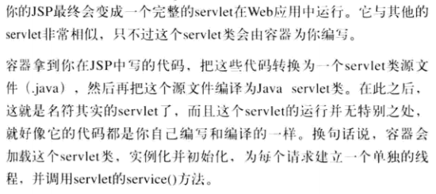

### 1.3分析JSP生成的Servlet代码
 当用户第一次访问JSP页面时，该页面都会被JspServlet翻译成一个Servlet源文件，然后将源文件编译为.class文件，Servlet源文件和.class文件都放在 

		/*
	 * Generated by the Jasper component of Apache Tomcat
	 * Version: Apache Tomcat/9.0.1
	 * Generated at: 2017-12-17 12:00:02 UTC
	 * Note: The last modified time of this file was set to
	 *       the last modified time of the source file after
	 *       generation to assist with modification tracking.
	 */
	package org.apache.jsp;
	
	import javax.servlet.*;
	import javax.servlet.http.*;
	import javax.servlet.jsp.*;
	import java.util.ArrayList;
	import java.util.List;
	
	// 一个final类，继承了 HttpJspBase，其实这个类也是继承了Servlet的
	public final class _1_jsp extends org.apache.jasper.runtime.HttpJspBase
	    implements org.apache.jasper.runtime.JspSourceDependent,
	                 org.apache.jasper.runtime.JspSourceImports {
	
	 int a = 1;   //这一句对应的就是JSP中的   <%! int a = 1; %>   用于声明成员变量和方法
	
	  private static final javax.servlet.jsp.JspFactory _jspxFactory =
	          javax.servlet.jsp.JspFactory.getDefaultFactory();
	
	  //对应<%@taglib uri="http://java.sun.com/jsp/jstl/core" prefix="c"%>
	  //引入 jstl标签库，其实是封装到了一个Map集合中   
	  private static java.util.Map<java.lang.String,java.lang.Long> _jspx_dependants;
	
	  static {
	    _jspx_dependants = new java.util.HashMap<java.lang.String,java.lang.Long>(2);
	    _jspx_dependants.put("/WEB-INF/lib/standard.jar", Long.valueOf(1513507951000L));
	    _jspx_dependants.put("jar:file:/Users/sam/Library/apache-tomcat-9.0.1/webapps/day10_2/WEB-INF/lib/standard.jar!/META-INF/c.tld", Long.valueOf(1098682290000L));
	  }
	
	
	 //******************中间省略一些代码**************
	
	
	  //重写init()方法
	  public void _jspInit() {
	  }
	  //重写destroy()方法
	  public void _jspDestroy() {
	  }
	
	  //重写service()方法
	  public void _jspService(final javax.servlet.http.HttpServletRequest request, final javax.servlet.http.HttpServletResponse response)
	      throws java.io.IOException, javax.servlet.ServletException {

    final java.lang.String _jspx_method = request.getMethod();
    if (!"GET".equals(_jspx_method) && !"POST".equals(_jspx_method) && !"HEAD".equals(_jspx_method) && !javax.servlet.DispatcherType.ERROR.equals(request.getDispatcherType())) {
      response.sendError(HttpServletResponse.SC_METHOD_NOT_ALLOWED, "JSPs only permit GET POST or HEAD");
      return;
    }

    //jsp中的一些内置对象，pageContext，session，application，out等
    final javax.servlet.jsp.PageContext pageContext;
    javax.servlet.http.HttpSession session = null;
    final javax.servlet.ServletContext application;
    final javax.servlet.ServletConfig config;
    javax.servlet.jsp.JspWriter out = null;
    final java.lang.Object page = this;
    javax.servlet.jsp.JspWriter _jspx_out = null;
    javax.servlet.jsp.PageContext _jspx_page_context = null;

    try {
      response.setContentType("text/html; charset=UTF-8");
      pageContext = _jspxFactory.getPageContext(this, request, response,
                null, true, 8192, true);
      _jspx_page_context = pageContext;
      application = pageContext.getServletContext();
      config = pageContext.getServletConfig();
      session = pageContext.getSession();
      out = pageContext.getOut();
      _jspx_out = out;

      //用out往浏览器写入html标签
      out.write("\n");
      out.write("\n");
      out.write("\n");
      out.write("\n");
      out.write("<!DOCTYPE html PUBLIC \"-//W3C//DTD HTML 4.01 Transitional//EN\" \"http://www.w3.org/TR/html4/loose.dtd\">\n");
      out.write("<html>\n");
      out.write("<head>\n");
      out.write("<meta http-equiv=\"Content-Type\" content=\"text/html; charset=UTF-8\">\n");
      out.write("<title>Insert title here</title>\n");
      out.write("</head>\n");
      out.write("<body>\n");
      out.write("    ");
      out.write("\n");
      out.write("    \n");
      out.write("    ");

### 1.4JSP基本语法

#### 1.4.1 JSP模板元素
**JSP页面可以按照编写HTML的方式来编写，其中可以包含HTML文件的所有静态内容，在静态的HTML内容中可以嵌套JSP的其他各种元素来产生动态内容和执行业务逻辑。JSP页面中的静态HTML内容成为JSP模板元素。JSP模板元素定义了网络的基本骨架，即定义了页面的布局和结构** 

#### 1.4.2 JSP表达式

JSP表达式用于将程序数据输出到客户端，它将要输出的变量或表达式直接封装到 一 “<%="开头 以”%>“结尾的标记中，其基本语法格式如下：
	
	<%=expression %>

#### 1.4.3 JSP脚本片段
JSP脚本片段是指嵌套在<% 和  %>之中的一条或者多条Java程序代码，这些Java程序代码必须严格遵守Java语法规范，否则编译会报错。

	<%   %>

* 在一个JSP页面中，可以出现多个脚本片段
* 在两个或多个脚本片段中间可以嵌套文本，HTML标记或其他JSP元素
* 这些脚本片段中的代码可以相互访问

#### 1.4.4 JSP声明
	
	当JSP页面被翻译为Servlet程序时，JSP中包含的脚本片段、表达式、模板元素豆浆转换为Servlet中_jspService()方法中的程序代码。

	这时，JSP脚本片段中定义的变量都将成为_jspService()方法中的局部变量

	在JSP中为了定义全局变量 方法 ，提供了声明

	
**声明：** 

	<%!  >

被声明的Java代码都将被翻译到Servlet的_jspService()方法之外，即在JSP声明中定义的都是 成员方法、成员变量、静态变量、静态代码块等。

#### 1.4.5JSP注释
	
	<%--  %>

**小结** 

	
语法|作用

###1.5 JSP指令

为了设置JSP页面中的一些信息，Sun公司提供了JSP指令。 
**JSP2.0中共定义了page、include和taglib三种指令，每种指令都定义了各自的属性** 
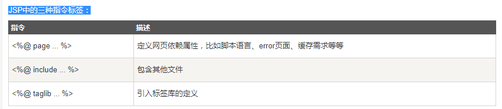
	<%@ 指令 属性名=“属性值”%>
####1.5.1 Page指令

在JSP页面中，经常需要对页面的某些特征进行描述，例如，页面的额编码方式，JSP页面采用的语言等等，这时可以通过page指令来实现：
	
	<%@ page="属性值"%>

（1）language:

language属性有默认，写成别的编译不了

写法是：<%@ page language="java"%>
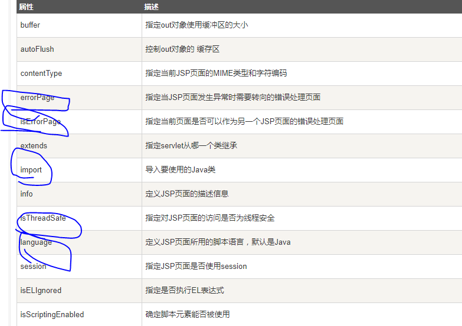

**web.xml文件配置通用的错误页面:** 
	
	在JSP程序中，如果为每个页面指定一个错误页面，这样的做法显然很繁琐，这时，可以在web.xml文件中使用 <error-page>元素为整个Web应用程序设置错误处理页面: 

	<error-page>
	
		<error-code> 404 </error-code>
		<location>  /404.jsp </location>
	</error-page>

#### 1.5.2 include指令

有时候，需要在JSP页面中静态包含一个文件，例如HTML问价，文本文件等，这时，可以通过include指令来实现，include指令的拘役语法格式如下: 

	<%@ include file="relativeURL" %>

### 1.6、JSP隐式对象
**在JSP页面中，有一些对象需要频繁使用，如果每次创建这些对象则会非常麻烦，为此JSP提供了9个隐式对象，他们是JSP默认创建的，可以直接在JSP页面使用。** 

 **利用隐士对象，编写JSP时应该知道你的代码将成为Servlet的一部分，可以充分利用Servlet性，尽管并不是我们自己编写的Servlet**  

 **每个JSP文档，容器会将其翻译为Servlet，为了冲分利用Servlet的特性，容器在JSP中提供了一些Servlet中常用对象的引用，可以直接使用，虽然我们未曾定义，称为隐士对象。**  

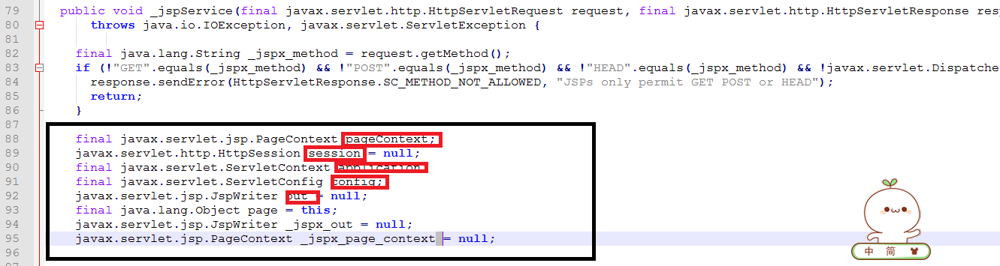

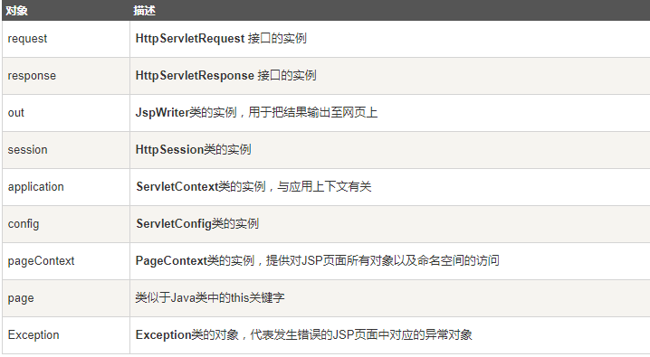

#### 1.6.1 Request对象
request对象是javax.servlet.http.HttpServletRequest 类的实例。每当客户端请求一个JSP页面时，JSP引擎就会制造一个新的request对象来代表这个请求。

request对象提供了一系列方法来获取HTTP头信息，cookies，HTTP方法等等。

#### 1.6.2 response对象

response对象是javax.servlet.http.HttpServletResponse类的实例。当服务器创建request对象时会同时创建用于响应这个客户端的response对象。

response对象也定义了处理HTTP头模块的接口。通过这个对象，开发者们可以添加新的cookies，时间戳，HTTP状态码等等。

#### 1.6.3 session对象
session对象是 javax.servlet.http.HttpSession 类的实例。和Java Servlets中的session对象有一样的行为。

session对象用来跟踪在各个客户端请求间的会话。

#### 1.6.4 application对象
application对象直接包装了servlet的ServletContext类的对象，是javax.servlet.ServletContext 类的实例。

这个对象在JSP页面的整个生命周期中都代表着这个JSP页面。这个对象在JSP页面初始化时被创建，随着jspDestroy()方法的调用而被移除。

通过向application中添加属性，则所有组成您web应用的JSP文件都能访问到这些属性。

#### 1.6.5 config对象
onfig对象是 javax.servlet.ServletConfig 类的实例，直接包装了servlet的ServletConfig类的对象。

这个对象允许开发者访问Servlet或者JSP引擎的初始化参数，比如文件路径等。

以下是config对象的使用方法，不是很重要，所以不常用：

#### 1.6.6page 对象
这个对象就是页面实例的引用。它可以被看做是整个JSP页面的代表。

page 对象就是this对象的同义词。

#### 1.6.7 exception 对象
exception 对象包装了从先前页面中抛出的异常信息。它通常被用来产生对出错条件的适当响应。

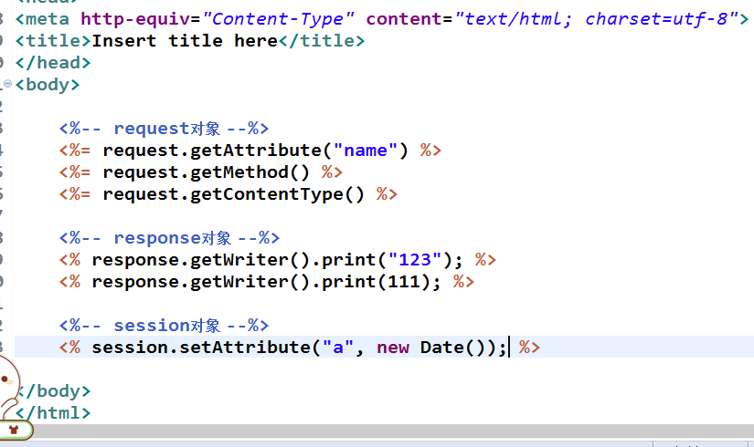
#### 1.6.8out对象

在JSP页面中，经常需要向客户端发送文本内容，这时，可以使用out对象来实现。out对象是 javax.servlet.jsp.JspWriter类的实例对象，它的作用于ServletResponse.getWriter()方法返回PrintWriter对象非常相似，都是用来向客户端发送文本形式的实体内容。不同的是out对象类型为JspWiter，它相当于一种带缓存功能的PrintWriter。

#### 1.6.9 pageContext对象
**在JSP页面中，要想获取JSP隐式对象，可以使用pageContext对象，pageContext对象是javax.Servlet.jsp.pageContext类的实例对象，它代表当前JSP页面的运行环境，并提供了一系列用于获取其他隐式对象的方法。** 
 **通过PageContext获取其他隐式对象**  
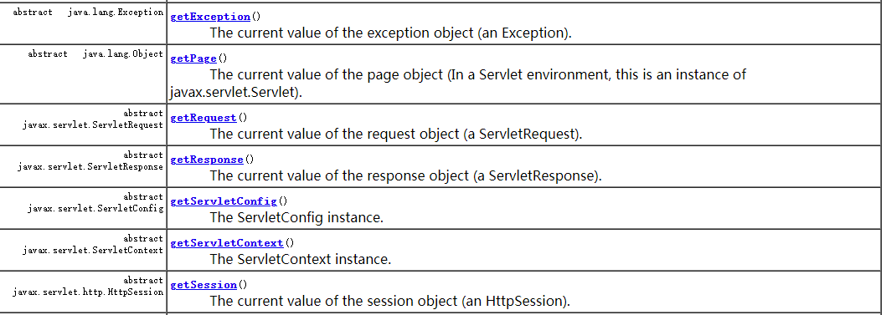

 **pageContext对象不仅提供了获取隐式对象的方法，还提供了存储数据的功能。pageContext对象存储数据是通过操作属性来实现的。**  

#### 1.6.10 JSP中的属性
**属性就是在对象中绑定一个键值对，在JSP中除了标准的Servlet请求、会话和应用(上下文)作用域外，JSP还增加了第4个作用域，即页面作用域pageContext。**  

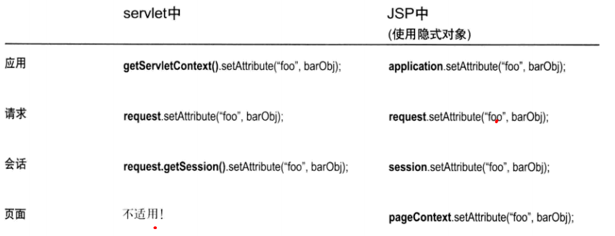

**可以从PageContext引用来得到任意作用域的属性，访问其他作用域的方法要取一个int参数，这个参数用来指示是哪一个作用域。** 

### 1.7 JSP标签(JSP动作)

**JSP页面可以嵌套一些Java代码来完成某种功能，但是这种Java代码会是的JSP页面很乱，不利于调试，为了减少JSP页面中的Java代码，SUN公司允许在JSP页面中嵌套一些标签，这些标签可以完成各种通用的JSP页面功能，被称为JSP标签** 

JSP标签也称为JSP Action(JSP动作)元素，用于在JSP页面中封装Java代码，这样使得在JSP页面中避免直接编写Java代码，让JSP真正成为MVC模式中的作为视图作用。
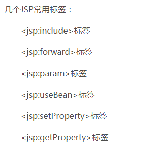

#### 1.7.1 <jsp:include>标签

在JSP页面中，为了把其他资源的输出内容插入到当期JSP页面的输出内容中，JSP技术提供了<jsp:include>标签，<jsp:include>标签的具体格式语法如下： 
	
	<jsp:forward page="relativeURL" flush="true|false">

* **page:指定引入资源的相对路径**
* **flush：指定是否将当前页面的内容刷新输出到客户端**

#### 1.7.2 <jsp:forward>标签

在JSP页面中，经常需要将请求转发给另外一个资源，这时，除了RequestDispatcher.forward()方法可以实现外，还可以通过<jsp:forward>标签来实现。<jsp:forward> 标签的具体语法格式如下： 
	
	<jsp:forward page="relativeURL"/>

* **Page属性用于指定请求转发到资源的相对路径，该路径是相对于当前JSP页面的URL**   

##2、JavaBean组件

在软件开发时，一些数据和功能需要在很多地方使用，为了方便将他们进行“移植”，Sun公司提出了一种JavaBean技术，使用JavaBean可以对数据和功能进行封装，做到一次编写，到处运行。

###2.1 JavaBean
#### 2.1.1什么是JavaBean

	JavaBean是Java开发语言中一个可以重复使用的软件组件，它本质上就是一个Java类，

	为了规范JavaBean的开发，Sun公司发布了JavaBean的规范，它要求一个标准的JavaBean遵循一定的规则：

* 必须有一个公共的，无参的构造方法
* 它提供公共的setter方法和getter犯法让外部程序设置和获取JavaBean

###2.2 JSP标签访问JavaBean
为了在JSP页面中简单快捷地访问JavaBean,并且充分地利用JavaBean的特性，JSP规范专门定义了三个JSP标签<jsp:useBean>、<jsp:setProperty>和<jsp:setProperty>。

#### 2.2.1、<jsp:useBean>标签

<jsp:useBean>标签用于在某个指定的域范围（pageContext、request、session、application等)中查找一个指定名称的JavaBean对象，如果存在则直接返回该JavaBean对象的引用，如果不存在则实例化一个新的JavaBean对象并将它按指定的名称存储在指定的与范围内。JSP:useBean的语法格式如下： 

		<jsp:useBean  id=""  

					  [scope="{page|request|session|application}"]
					  
                      class = "package.class"

					  type="package.class"

					  beanName ="">

**jSP:useBean>标签中有5个属性** 

* **id:用于指定JavaBean实例对象的引用名称和其存储在域范围中的名称**  
* **scope:用于指定JavaBean实例对象所存储的域范围，其取值智能是page、request、session和application4个值中的一个，其默认值是page**  

* **class:用于指定JavaBean的完整类名（即必须带有包名），JSP容器将使用这个类名来创建JavaBean的实例对象或作为查找到的JavaBean对象的类型**  

* **type用于指定JavaBean对象的引用变量类型，它必须是JavaBean对象的类名称、父类名称或JavaBean实现的接口名称。type属性的默认值为class属性的设置值，当JSP容器将<jsp:useBean>标签翻译成Servlet程序时，它将使用type属性值作为JavaBea对象引用变量的类型。**  

* **beanName:用于指定JavaBean的名称，它的值也是a.b.c的形式，这即可以代表一个类的完整名称，也可以代表a/b/c.ser这样的资源文件。**  
 

----------
------------
**例1:单独使用class** 
	
	 	<jsp:useBean id="manager" scope="page"  class="com.monkey.bean.Manager">         </jsp:useBean>

**生成的Servlet:** 
		
		//根据提供的class生成对象，注意变量名
	  com.monkey.bean.Manager manager = null;
	 
	  //获取PAGE_SCOPE中的对象
      manager = (com.monkey.bean.Manager) _jspx_page_context.getAttribute("manager", javax.servlet.jsp.PageContext.PAGE_SCOPE);
		
	//如果从域中获取的对象为空（即该域中没有存储对像）
      if (manager == null){
		//生成新的对象
        manager = new com.monkey.bean.Manager();
		//存储对象
        _jspx_page_context.setAttribute("manager", manager, javax.servlet.jsp.PageContext.PAGE_SCOPE);

        out.write("         ");
      }

**需要特别注意的是，翻译成的Servlet代码中，用于引用JavaBean实例对象的变量名和JavaBean存储在域中的名称均为id属性设置的值manager** 

---------
---------

**例2:单独使用type** 
	
		 	<jsp:useBean id="manager" scope="page" type="com.monkey.bean.Manager">         </jsp:useBean>

**生成的Servlet:** 
			
		//生成对象
			 com.monkey.bean.Manager manager = null;
		//获取域中的对象
      manager = (com.monkey.bean.Manager) _jspx_page_context.getAttribute("manager", javax.servlet.jsp.PageContext.PAGE_SCOPE);
		//没有获取到对象则报错
      if (manager == null){
        throw new java.lang.InstantiationException("bean manager not found within scope");
      }

----------
----------

**例3:class属性和type属性结合使用** 

 	<jsp:useBean id="manager"   type="com.monkey.bean.Manager" beanName="com.monkey.bean.Manager">         </jsp:useBean>

**翻译成的Servlet** 

	 com.monkey.bean.Manager manager = null;
      manager = (com.monkey.bean.Manager) _jspx_page_context.getAttribute("manager", javax.servlet.jsp.PageContext.PAGE_SCOPE);
      if (manager == null){
        try {
          manager = (com.monkey.bean.Manager) java.beans.Beans.instantiate(this.getClass().getClassLoader(), "com.monkey.bean.Manager");
        } catch (java.lang.ClassNotFoundException exc) {
          throw new InstantiationException(exc.getMessage());
        } catch (java.lang.Exception exc) {
          throw new javax.servlet.ServletException("Cannot create bean of class " + "com.monkey.bean.Manager", exc);
        }
        _jspx_page_context.setAttribute("manager", manager, javax.servlet.jsp.PageContext.PAGE_SCOPE);
        out.write("         ");
      }

从上面的代码可以看出，JSP容器会在scope属性指定的域范围内查找以id属性值为名称的JavaBean对象如果该域范围中不存在指定JavaBean对象，JSP容器会加载当前类的对象和beanName属性值作为参数传递给ava.beans类的instantiate()方法，去创建爱你新的JavaBean类对象。 

#### 2.2.2、<jsp:setProperty>标签：设置属性值

**<jsp:useBean>标签可以创JavaBean对象，但是要想为JavaBean对象设置属性，还需要通过<jsp:setproperty>标签来实现。其语法格式如下：** 

	
	<jsp:setProperty name="beanInstanceName"
						
					 propert = "propertyNmae"  value =""
					
					 property="propertyNmae"  param="parameterName"
					
					 property="propertyName"/>

* **name:用于指定JavaBean实例对象的名称，其值应给和<jsp:useBean>标签的id属性值相同。**  

* **property:用于指定JavaBean实例对象的属性名**  

* **param:用于指定请求信息中参数的名字在设置JavaBean的属性时，如果请求参数的名字和JavaBean属性的名字不同，可以使用param属性，将其指定的参数的值设置给JavaBean的属性。如果当前请求信息中没有param属性所指定的请求参数，那么<jsp:setProperty>什么也不做。** 

* **value:用于指定为JavaBean实例对象的某个属性设置的值，其值可以是一个 字符串，也可以是一个JSP表达式。如果value属性的值是字符串，那么它将被自动转换成索要设置的JavaBean属性的类型**
  

**在使用<jsp:setProperty>标签时，name属性和property属性必须指定，propertry属性可以单独使用，也可以和value属性或者param属性配合使用** 

-------------------
 **property单独使用**  
（1）当Property属性值为JavaBean的一个属性名时，JSP容器会将请求消息中与property属性值同名的参数的值域赋值给JavaBean对应的属性。 

(2)当property的属性值为星号（*）时，容器会在请求信息中匹配所以和JavaBean的属性。
	
 **（1）：缺点只能匹配一个，表单中的属性名必须和JavaBean中的属性名匹配**  	
 	<jsp:useBean id="manager"   class="com.monkey.bean.Manager" >         </jsp:useBean>
 	<jsp:setProperty property="bonus" name="manager"/>
 	
 	<%
 		 manager = (com.monkey.bean.Manager)pageContext.getAttribute("manager");
 		 out.print(manager.getBonus());
 	
 	%>

 **翻译成sERvlet**  

		//引用
		 com.monkey.bean.Manager manager = null;
		//获取对象
      manager = (com.monkey.bean.Manager) _jspx_page_context.getAttribute("manager", javax.servlet.jsp.PageContext.PAGE_SCOPE);
		//如果为空则生成一个空对象
      if (manager == null){
        manager = new com.monkey.bean.Manager();
        _jspx_page_context.setAttribute("manager", manager, javax.servlet.jsp.PageContext.PAGE_SCOPE);
        out.write("         ");
      }
      out.write("\r\n");
      out.write(" \t");
		//设置属性
      org.apache.jasper.runtime.JspRuntimeLibrary.introspecthelper(_jspx_page_context.findAttribute("manager"), "bonus", request.getParameter("bonus"), request, "bonus", false);
      out.write("\r\n");
      out.write(" \t\r\n");
      out.write(" \t");

 		 manager = (com.monkey.bean.Manager)pageContext.getAttribute("manager");
 	
		 out.print(manager.getBonus());

--------------------

 **（2）：缺点表单中的属性必须要和JavaBean中的属性名匹配**  
		
		<jsp:useBean id="manager"   class="com.monkey.bean.Manager" >         </jsp:useBean>
	 	<jsp:setProperty property="*" name="manager"/>
	 	
	 	<%
	 		 manager = (com.monkey.bean.Manager)pageContext.getAttribute("manager");
	 		 out.print(manager.getBonus());
	 		 out.print(manager.getCompany());
	
	 	%>

 **翻译成sERvlet**  
	
	  manager = (com.monkey.bean.Manager) _jspx_page_context.getAttribute("manager", javax.servlet.jsp.PageContext.PAGE_SCOPE);
      if (manager == null){
        manager = new com.monkey.bean.Manager();
        _jspx_page_context.setAttribute("manager", manager, javax.servlet.jsp.PageContext.PAGE_SCOPE);
        out.write("         ");
      }
      out.write("\r\n");
      out.write(" \t");
      //在这里封装好处理请求
      org.apache.jasper.runtime.JspRuntimeLibrary.introspect(_jspx_page_context.findAttribute("manager"), request);
      out.write("\r\n");
      out.write(" \t\r\n");
      out.write(" \t");

 		 manager = (com.monkey.bean.Manager)pageContext.getAttribute("manager");
 		 out.print(manager.getBonus());
 		 out.print(manager.getCompany());
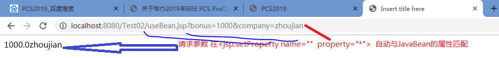

-----------------

 **property属性和param属性配合使用**  

**在实际开发中，很多时候服务器需要使用表单传递的数据作为JavaBean对象的属性赋值，但是如果，单中表单项name属性的值和name属性中名不匹配，该如何应对呢？要想实现上述功能，就需要在<jsp:setProprty>标签中使用property属性和param属性** 
		   <jsp:useBean id="manager"   class="com.monkey.bean.Manager" >         </jsp:useBean>
 	
	 	 <!-- param中的参数需要和表单中提交的数据相匹配  本行中获取表单中 com:部分的value值 -->
	 	 <jsp:setProperty property="company" param="com" name="manager"/>
	 	
	 	<jsp:setProperty property="bonus" param="bon" name="manager"/>
	 	
	 	<%
	 		 manager = (com.monkey.bean.Manager)pageContext.getAttribute("manager");
	 		 out.print(manager.getBonus());
	 		 out.print(manager.getCompany());
	
	 	%>
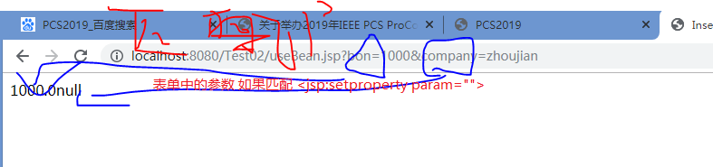

-----------

 **property属性和value属性配合使用**  
**当property属性和value属性配合使用时，JSP容器会使用value属性的值为JavaBean的属性赋值，优先于PARAM从表单中获取属性** 

### 2.2.3 <jsp:getProperty>标签
  
**为了获取JavaBean的属性值，JSP规范提供了<jsp:getProperty>标签，它可以访问JavaBean的属性，并把属性的值转换为一个字符串发送到响应输出流中** 

		
	<jsp：getProperty name="beanInstanceName" property="propertyName"、>

**（1）:name:用于指定JavaBean实例对象的名称，其值应该和<jsp:useBean>标签的id属性值相同** 

**（2）：property:用于指定JavaBean实例对象的属性名** 

