**得意处论地谈天，俱是水底捞月；拂意时吞冰啮雪，才为火内栽莲。**

## 1、基础知识
### 1.1浏览器请求与服务器响应模型
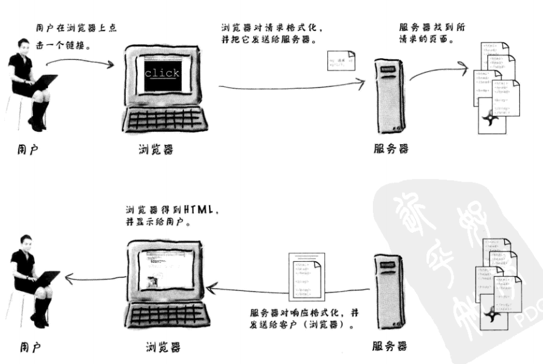

* **HTTP是Web上客户端与服务器之间进行通信时所用的协议**<br><br>
* **服务器使用HTTP向客户发送HTML**


<font color="red" size="100px">**这很重要，下面的字段是标准，所开发的接口都围绕着着写要素来展开，理解即可，尤其是一些重要的首部字段，决定这服务器与浏览器之间的交互方式与各自的动作！！！**</font><br>
**请求流的关键要素**<br>

* HTTP方法(要完成的动作）。
* 要访问的页面(URL)。
* 表单参数（如方法参数等)。

**响应流的关键要素**<br>

* 状态码（表示请求是否成功)
* 内容类型(包括文本、图片、HTML等）。
* 内容（具体的HTML、图片等)。


**URL**
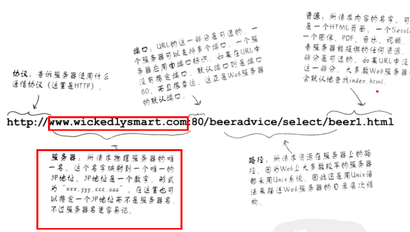


**静态页面和动态页面**<br>

* 静态页面：原封不动地呆在目录中。服务器找到静态页面，并把它原样传回给客户。每个客户看到的东西都一样。<br>
* Web服务器应用只提供静态页面，但是有一个辅助应用可以生成非静态的即时页面，而且这个辅助应用能与Web服务器通信。动态页面可以是一个编目、Web日志，甚至只是一个随机选择显示图片的页面.
*

### Eclipse中JavaWeb

**目录结构**
<br>


## 2、Web应用体系

### 2.1、什么是容器
**Servlet没有main方法。它们受控于另一个Java应用，这个Java应用称为容器**<br>
*Tomcat就是这样一个容器。如果Web服务器应用得到一个指向某Servlet的请求（而不是其他请求，如请求一个普通的静态HTML页面），此时服务器不是把这个请求交给Servlet本身，而是交给部署该Servlet的容器。要由容器向Servlet提供HTTP请求和响应，而且要由容器调用Servlet的方法。*

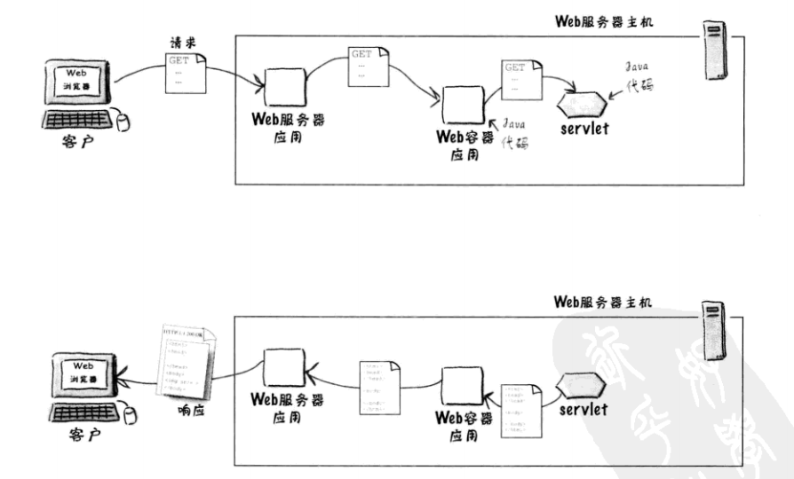


### 2.2容器能提供什么？

 * 通信支持：利用容器提供的方法，能够轻松的让Servlet与Web服务器对话。无需自己建立ServerSocket、监听端口、创建流等。容器知道自己与Web服务器之间的协议，所以你的Servlet不必担心Web服务器和自己Web代码之间的API。
 * 生命周期管理：容器控制着Servlet的生与死。它会负责加载类、实例化和初始化Servlet、调用Servlet方法，并使servlet实例能够被垃圾回收。有了容器的控制，你就不用太多的考虑资源管理
 * 多线程支持：容器会自动的为它接收的每个Servlet请求创建一个新的线程，针对客户的请求，如果servlet已经运行完响应的HTTP方法，这个线程就会结束（也就是会死掉）。这并不是说不用考虑线程安全性，还是会遇到同步的问题到 。
 * 声明方式实现安全：利用容器，可以使用XML部署描述来配置（和修改）安全性，而不必将其硬编码写到servlet（或其他）类代码中。 **注解到底好不好**
 * JSP支持

### 2.3 容器如何处理请求
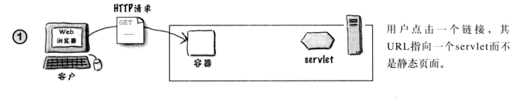
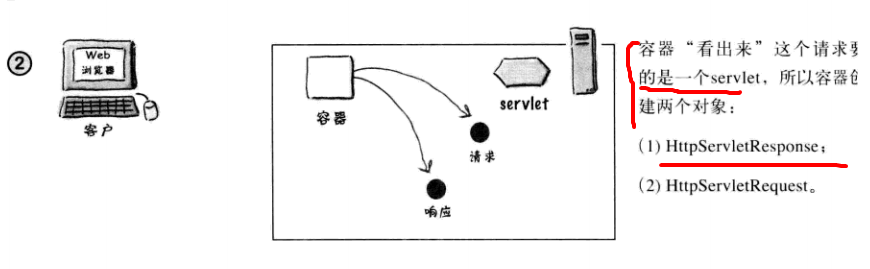
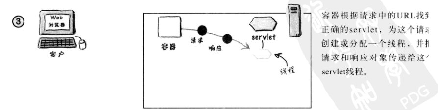
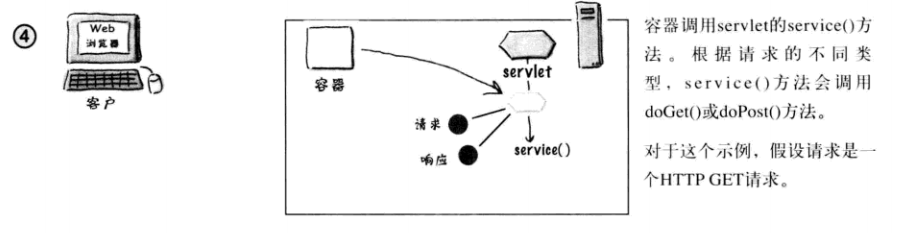
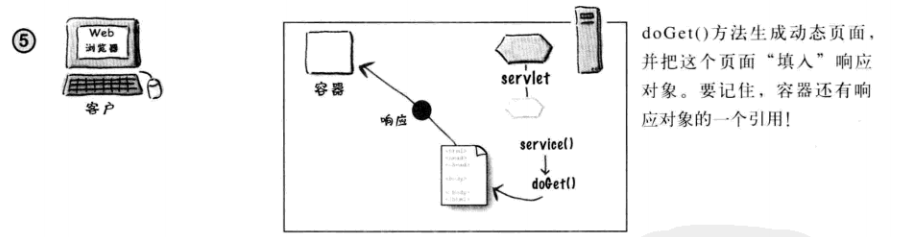
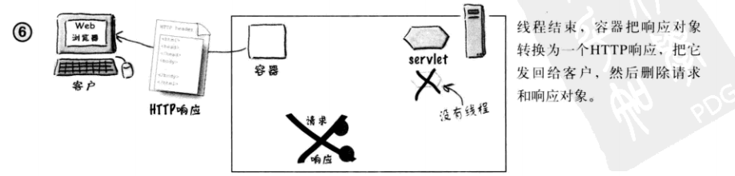
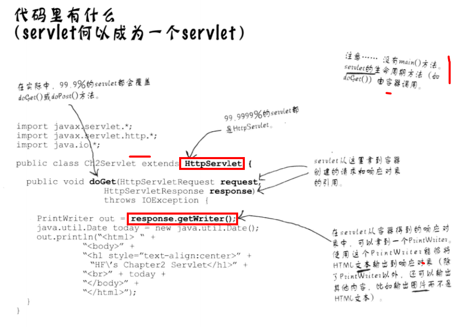


### 2.4容器是怎样根据url找到servlet
**使用部署描述文件将URL映射到Servlet**<br>
将Servlet部署到Web容器时，会创建一个相当简单的XML文档，这称为部署描述文件（DD),部署描述文件会告诉容器如何运行你的Servlet和JSP。尽管使用部署描述文件不只是为了映射Servlet名，最起码要知道，可以使用两个XML元素把URL映射到servlet,其中一个将客户知道的URL名映射到你自己的内部名，另一个元素把你自己的内部名映射到一个完全限定类名。<br>
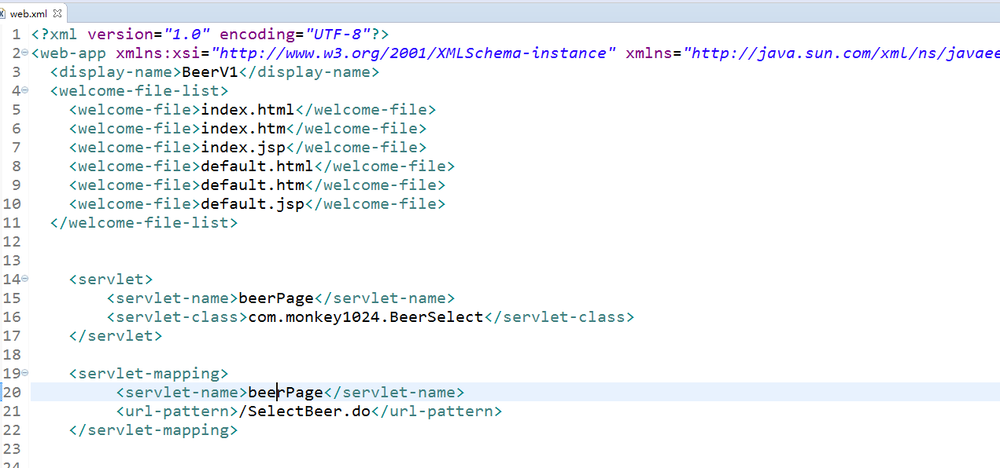

**除了把URL映射到实际的Servlet，还可以使用部署描述文件对Web应用的其他方面进行定制，包括安全角色、错误页面、标记库、初始配置信息等，**<br>
### 2.5 MVC初探
**模型-视图-控制器（MVC)就是把业务逻辑从Servlet中农抽出来，把它放在一个模型中，所谓模型就是一个可重用的普通Java类。模型是业务数据（如购物车的状态）和处理改数据的方法（规则）的组合。**<br>

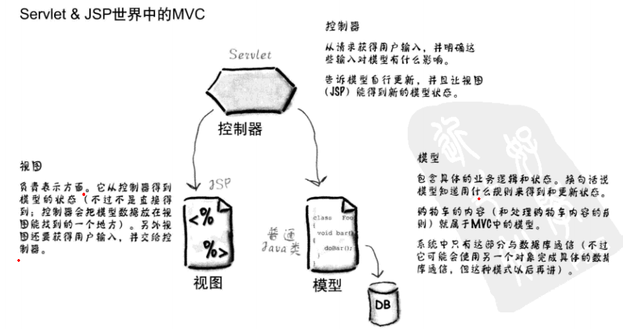
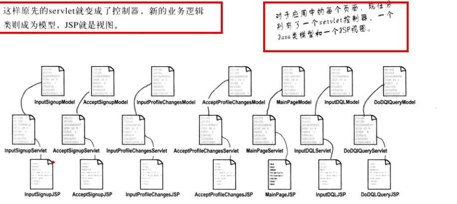


## 3 Servlet基础知识
**Servlet的存在就是要为客户服务。Servlet的任务是得到一个客户的请求，再发回一个响应。请求可能很简单:请给我一个欢迎页面，也可能很复杂：为我的购物车结账。这个请求携带着一些中要的数据，你的Servlet代码必须知道怎么找到和使用这个请求。响应也携带者一些信息，浏览器需要这些信息来显示一个页面（或下载数据），你的Servlet代码必须知道怎么发送这些信息。或者不发送。。。。。你的Servlet也可以把请求传递给其他人（另一个页面、Servlet或者JSP）.**
### 3.1Servle生命周期
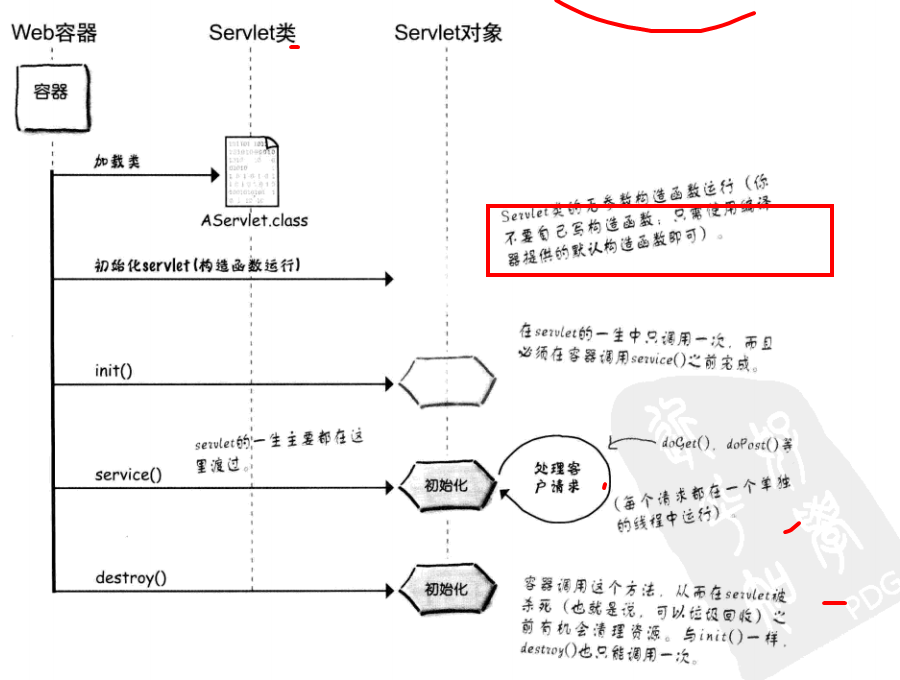
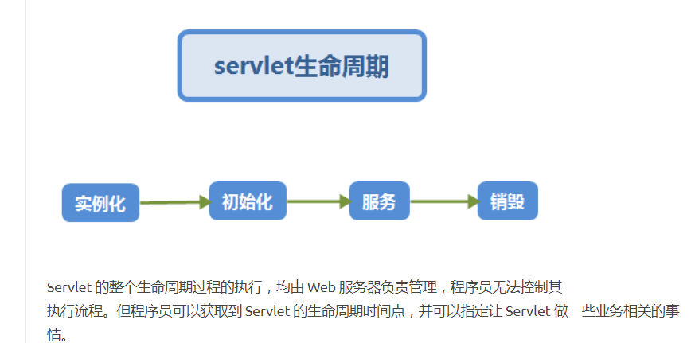
**流程：**<br>

* 项目部署后启动服务器，并没有执行Servlet的无参构造器方法，在Web容器启动时并没有创建Servlet对象。
* 用户提交请求URL后，马上可以看到无参构造方法、init()方法、Service()方法执行。
* 刷新页面，发现只会执行Service()方法，每刷新一次，即每提交一次请求，就会执行一次Service方法。
* 让另外一个浏览器也发出同样的请求，会发现只执行service()方法，而无参构造方法、init()方法均未执行。
* 正常关闭Tomcat，发现destroy()方法也会执行。

### 3.2Servlet特征
**Servlet的特征**<br>

* Servlet是单例多线程的，只创建一个servlet对象，但是每次请求都会起一个线程并在自己线程栈内存中执行service方法。<br>
* 一个 Servlet 实例只会执行一次无参构造器与 init()方法，并且是在第一次访问时执行。<br>
* 用户每提交一次对当前 Servlet 的请求，就会执行一次 service()方法。<br>
* 一个 Servlet 实例只会执行一次 destroy()方法，在应用停止时执行。<br>
* 由于 Servlet 是单例多线程的，所以为了保证其线程安全性，一般情况下是不建议在 Servlet类中定义可修改的成员变量，因为每个线程均可修改这个成员变量，会出现线程安全问题。
* 由于 Servlet 是单例多线程的，所以为了保证其线程安全性，一般情况下是不建议在 Servlet类中定义可修改的成员变量，因为每个线程均可修改这个成员变量，会出现线程安全问题。


### 3.3 Servlet的继承体系
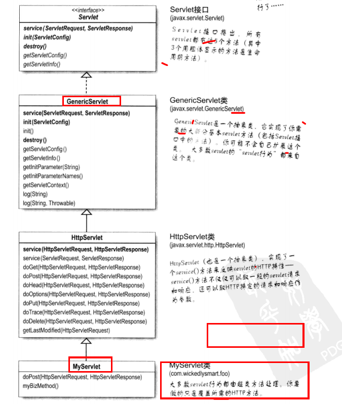

(1)一般程序继承 HTTPServlet，覆盖其中的 doGet、doPost等方法，覆盖的方法会在Service()方法中调用。<br>
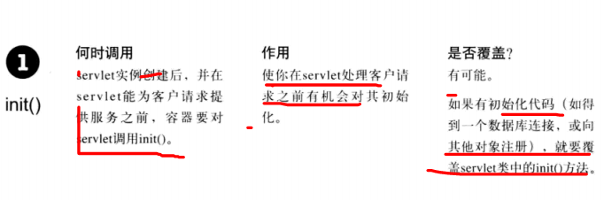
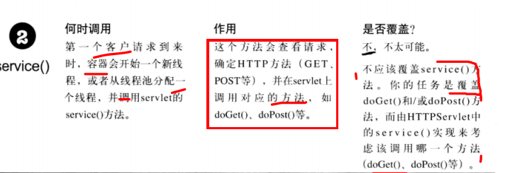
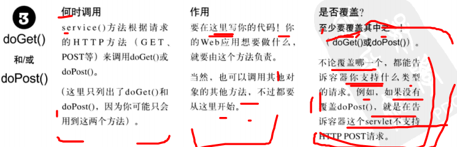

	每个请求都在一个单独的线程中运行！！！
	容器运行多个线程来处理对一个Servlet的多个请求。
	对应每个客户请求，会生成一对新的请求和响应对象。
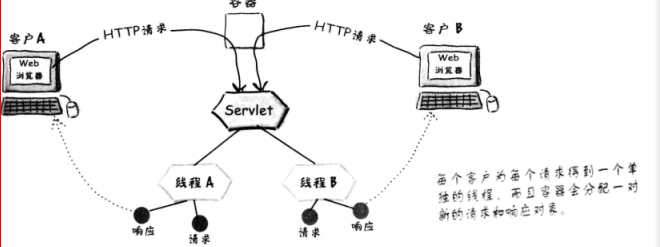

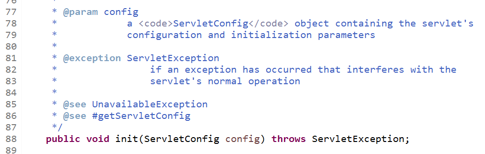

### 3.4 ServletConfig对象
**ServletConfig对象：从属于每一个Servlet**<br>

* 每个Servlet都要一个ServletConfig对象


* 用于向Servlet传递部署信息（例如数据库或企业bean的查找名），而你不想把这个信息硬编码写到Servlet中(servlet初始化参数）


* 用于访问 ServletContext


* 参数在部署描述文件中配置

### 3.5 ServvletContext对象
**ServletContext:从属于整个应用**<br>

* 每个Web应用有一个ServletContext（应该叫做AppContext才对）

* 用于访问Web应用参数(也在部署描述文件中配置)


* 相当于一种应用公告栏，可以在这里放置消息（称为属性），应用的其他部分可以访问这些消息


* 用于得到服务器信息，包括容器名和容器版本，以及所支持API的版本等，


## 4、客户端（用户）请求

### 4.1请求和响应：这是一切一切的关键（严格按照HTTP协议开发的API）
<font color="red">**针对Servlet的每次请求，Web服务器在调用Service()之前，都会创建两个对象，分别是HttpServletRequest和HttpServletResponse。其中，HttpServletRequest用于封装HTTP请求信息，简称request对象。HttpServletResponse用于封装HTTP响应信息，简称Response对象。**</font><br>

<font color="red">**需要注意的是，在Web服务器运行阶段，每个Servlet都只会创建一个实例对象。然而，每次HTTP请求，Web服务器都会调用所请求Servlet实例的service(HttpServletRequest,HttpServletResponse)方法，重新创建一个  request对象和response对象。**</font>


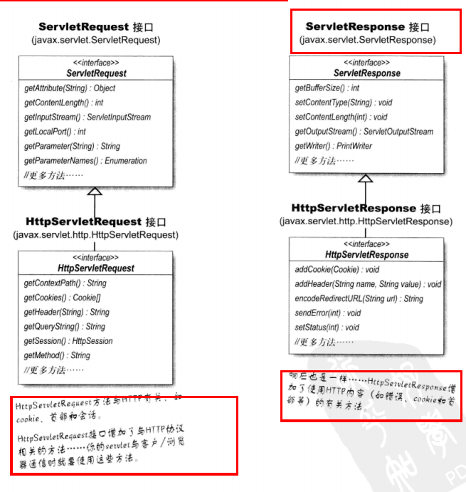<br>
**HTTP请求方法确定究竟运行doGet()还是doPost()**<br>
**要记住，客户的请求总是包含一个特定的HTTP方法。如果这个HTTP方法是GET,service（）方法就会调用doGet()。如果这个HTTP请求方法是POST,service()方法就会调用doPost（）。**<br>
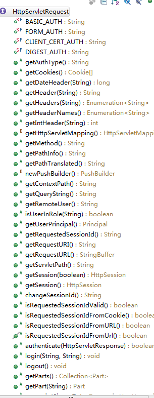


### 4.2 Request对象
<font color="red" size="10px"> 记住一点，request与response都是对HTTP协议的封装。</font>

**在Servlet API中，定义了一个HTTPServletRequest接口，专门用来封装HTTP请求消息。由于HTTP请求消息分为请求行、请求消息头和请求消息体三部分，因此在HttpServletRequest接口中定义了获取请求行、请求头和请求消息体的相关方法。**<br>

#### 4.2.1 获取请求行消息的相关方法


方法|作用|
-|-|
getMethod()|**获取HTTP请求消息体中的请求方式（如GET、POST)**
getRequestUri()|**获取请求行中资源名称部分，即位于URL主机和端口之后、参数部分之前的部分**
getQueryString()|**获取请求行中的参数部分，也就是资源路径名后面的问号(?)以后的所有内容**
getProtocol()|**用于获取请求行中的协议名和版本，例如：HTTP 1.0/HTTP 1.1**

#### 4.2.2 获取请求消息头的相关方法

	
	当请求Servlet时，需要通过请求头向服务器传递附加信息，例如，客户端可以接受的数据类型，压缩方式、语言等。为此，在HttpServletRequest接口中，定义了一系列用于获取HTTP请求头字段的方法。
方法|作用|
-|-|
getHeader(String name)|**获取指定头字段的值**
getHeaders(String name)|**返回多个**
getContentType()|**用于获取Content-Type头字段的值，结果为String类型**
getContentLength()|**用于获取Content-Length头字段的值，结果为 INT类型**
getCharcterEncoding()|**用于返回请求信息的实体部分的字符集编码**

#### 4.2.3 获取请求消息体的方法（不常用，下面的方法常用）

**用于HTTP请求消息中，用户提交的大量表单数据都是通过消息体发送给服务器的，为此，在HTTPServletRequest接口中，同样遵循以IO流传递大量数据的设计理念。（其实不常用）**<br>
<font color="red">**在实际应用中不常用。**</font><br>

方法|作用|
-|-|
getInputStream()|**获取表示实体内容的ServletInputStream对象**
getReader()|**获取表示实体内容的BufferedReader对象，该对象会将实体内容中的字节按照请求消息中指定的字符集编码转换成文本字符串**
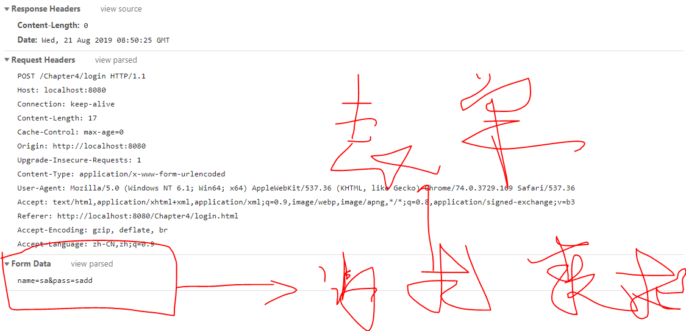
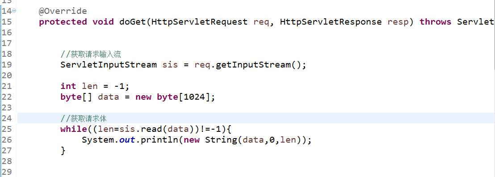


#### 4.2.4 获取请求参数

	容器做了字符串的处理工作，这样我们就可以直接获取请求参数啦！！！
**在实际开发中，经常需要获取用户提交的表单数据，例如：用户名、密码、电子邮件等，为了方便获取表单中的请求参数，在HttpServletRequest接口中，定义了一系列获取请求参数的方法**<br>

方法 | 作用
-|-|
getParameter(String)|根据参数获取传送的值
getParameterValues()|获取参数值
getParameterMap()|用于将请求消息中的所有参数名和值封装到一个Map对象返回

********************

#### 4.2.5 通过Request对象传递数据 （在对象 转发时可以用到）
**相当于为对象request绑定了一个Object**<br>
**Request对象不仅可以获取一系列数据，还可以通过属性传递数据，**<br>

方法|作用
-|-|
setAttribute(String,Object)|**将一个对象与一个名称关联后存进ServletRequest对象**
getAttribute(String name)|**从ServletRequest对象中返回指定名称的属性对象**
removeAttribute(String name)|**从ServletRequest对象中删除指定名称的属性**

*************

### 4.3 RequestDispatcher对象的应用

*当一个Web资源受到客户端的请求后，如果希望服务器通知另一个资源去处理请求，这时，除了使用sendRedirect()方法请求重定向外，还可以通过 RequestDispatcher接口对象来实现。在ServletRequest接口中定义了一个获取RequestDispatcher对象的方法：*
	
	方法： getRequestDispathcer(String path)
			
		  返回封装了某个路径锁指定资源的RequestDispatcher对象。

**获取到RequestDispatcher对象后，最重要的工作就是通知其他Web资源处理当前的Servlet，为此在RequestDispatcher接口中，定义了两个相关的方法：**<br>

方法|作用
-|-|
**forward(ServletRequest request, ServletResponse response)**|**用于将请求从一个Servlet传递给另外一个Web资源。在Servlet中，可以对请求做一个初步的处理，然后通过调用这个方法，将请求传递给其他资源进行响应**
**include(ServletRequest request, ServletResponse response)**|**该方法用于将其他的资源作为当前响应内容包含金老**

#### 4.3.1 请求转发
**在Servlet中，如果当前Web资源不想处理他的访问请求，可以通过forward()方法将当前请求传递给其他的Web资源进行处理。这种方式称为请求转发。**<br>


<font color="red">**forward()方法不仅可以实现请求转发，还可以使转发页面和转发到的页面共享数据。需要注意的是存储在request对象中的数据只对当前请求有效，而对其他请求无效。**</font><br>


```
	
	public class FirstServlet extends HttpServlet {

	@Override
	protected void doGet(HttpServletRequest req, HttpServletResponse resp) throws ServletException, IOException {
		
		resp.setContentType("text/html;charset=utf-8");
		// 将数据存储到request对象中
		req.setAttribute("存储转发的数据", "我爱你");
		
		//转发
		req.getRequestDispatcher("/test2").forward(req, resp); //将req和resp对象全部转发出去
	}

	-------------------------------------------------------------
	public class SecondServlet extends HttpServlet{

	@Override
	protected void doGet(HttpServletRequest req, HttpServletResponse resp) throws ServletException, IOException {
		PrintWriter out = resp.getWriter();
		String message = (String) req.getAttribute("存储转发的数据");
		out.print(message);
	}

	


````
#### 4.3.2请求包含
**请求包含指的是使用include()方法将Servlet请求转发给其他Web资源进行处理，与请求转发不同的是，在请求包含中，既包含当前Servlet的相应的信息也包含其他Web资源的响应信息。**


## 5.响应对象(response)

### 5.1 响应对象

**由于HTTP响应消息分为状态行、响应消息头、消息体三部分，因此，在HTTPServletResponse接口中定义了向客户端发送响应状态码，响应消息头、响应消息体的方法。**<br>
响应要返回给客户。这是浏览器得到、解析并呈现给用户的东西。一般地，你会使用响应对象得到一个输出流（通常是一个Writer）,并使用这个流写出HTML（或其他类型的内容）

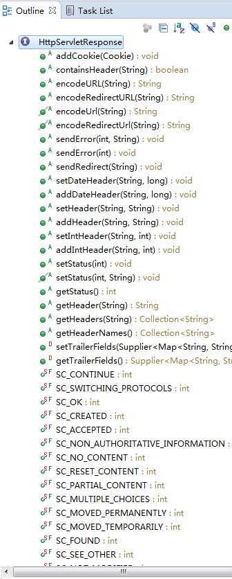
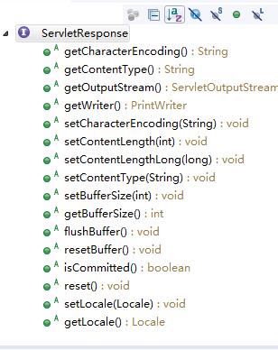


### 5.2 Response对象
#### 5.2.1 发送状态码相关方法

方法|作用|
-|-|
setStatus()| **设置HTTP响应信息的状态码**
sendErrror(int sc)|**发送表示错误信息的状态码**

#### 5.2.2 发送响应消息头的相关方法

方法|作用|
-|-|
setHeader()|**设置响应首部**
addheader()|**增加响应首部**
addIntHeader()| **增加包含整数值的响应头**
setIntHeader()|**设置包含整数值的响应头**
setContentLength(int len)|**设置响应消息的实体内容的大小，单位为字节**
setContentType()|设置内容类型（**必须要设置。一般为text/html；charset=UTF-8**）
setCharacterEncoding(String charset)|**设置输出内容使用的字符编码，对HTTP来说，就是设置Content-type;  必须在 getWriter() 方法之前执行**


#### 5.2.3  发送响应消息体相关的方法

<font color="red">**用于在HTTP响应消息中，大量的数据都是通过响应消息体传递的，因此，ServletResponse遵循以IO流传递大量数据的设计理念，在发送响应消息体时，定义了两个与输出流相关的方法。**</font><br>
<font color="red" size="10px"> 一般不用reponse.write()将内容从Servlet发送至HTML,所以引入JSP。</font>

方法|作用
-|-|
**getOutputStream()**|**获取字节输出流对象**
**getWriter()**|**获取字符输出流对象,Returns a <code>PrintWriter</code> object that can send character text to the client.The <code>PrintWriter</code> uses the character encoding returned by {@link #getCharacterEncoding}.**
******

### 5.3 利用response解决的一些问题
<font color="blue" size="10px"> **一些设置响应首部字段解决问题的应用：**</font><br>
#### 5.3.1 解决中文乱码问题
*1、为什么有中文乱码问题？*<br>
*2、怎么解决乱码问题？*<br>
**数据编解码格式不统一造成的，为了解决只需统一编解码格式即可，浏览器和编码格式最好统一为utf-8这种格式**

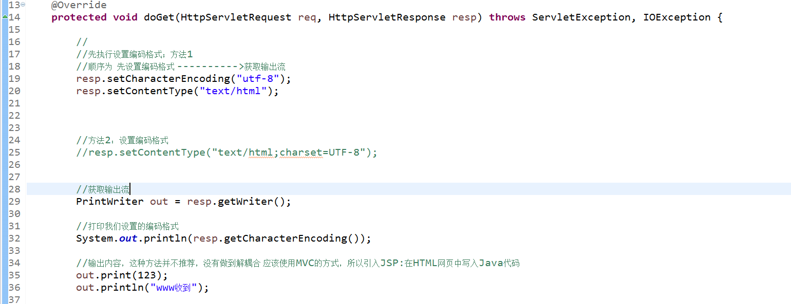

*******
*******
#### 5.3.2  网页定时刷新并跳转

**在Web开发中，有时会遇到定时跳转页面的需求。在HTTP中定义了一个Refresh头字段，它可以通知浏览器在指定的时间内自动刷新并跳转到其他页面。**<br>
	
	其实就是设置一个响应首部字段，通知浏览器接下来可以重新发送一个请求，跳转到指定的页面。

	HTTP协议中定义了一个Refresh头字段，用于告诉浏览器过多少秒后自动刷新页面。在Refresh头字段的时间设置值后面还可以用分号（;）分隔后，再指定一个URL地址，这将让浏览器在指定的时间值后自动去访问该URL地址指向的资源。 

	'''
	resp.setHeader("Refresh","2;http://WWW.baidu.com" ); //2秒后跳转http://www.baidu.com
	'''
**截取的请求和响应报文：**

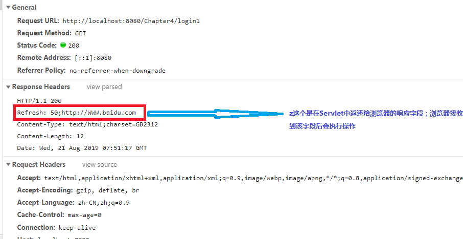
*******
*******
<font color="red">**禁止浏览器缓存页面：**</font><br>
	
	由于大多数网页内容都不会发生变化，因此，为了加快访问速度，很多浏览器都对访问过的页面进行缓存，
	
	例如表单的提交问题，为了解决问题，在HTTP响应信息中，需要设置以下头字段：
	
	Expires:0
	Cache-control:no-cache
	Pragram:no-cache

*****
*****
#### 5.3.3 请求重定向
**注意请求重定向与请求转发的区别：**<br>
	
	在某些情况下，针对客户端的请求，一个Servlet类可能无法完成全部的工作。
	
	这时，可以使用请求重定向来完成。所谓请求重定向，指的是Web服务器接收到客户端的请求后，可能由于某些条件限制，不能访问当前URL锁指向Web资源，而是指定了一个新的资源路径，让客户端重新发送请求。

	为了实现请求重定向，在HTTPServletResponse接口中，定义了一个sendRedirect()方法，该方法用于生成 302 响应码 和Location 响应头，
	从而通知客户端重新访问Location响应头中指定的URL，sendRedirect()
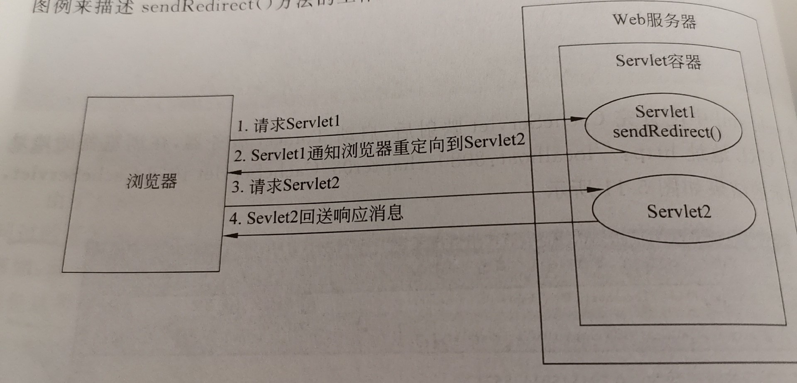

方法|作用
-|-|
sendRedirect(String location)|重定向
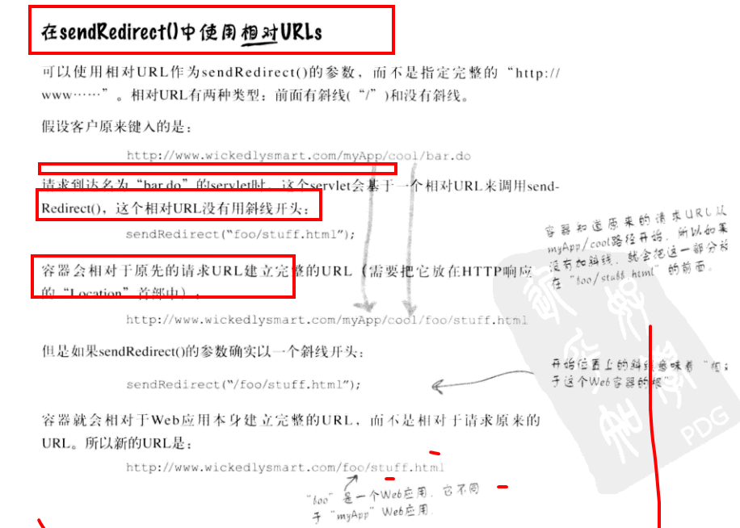

******