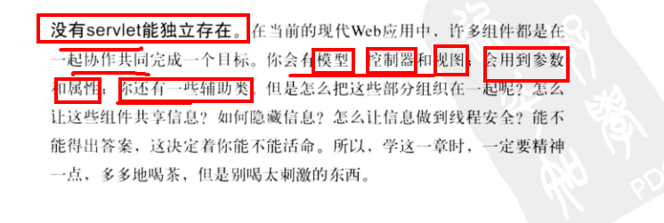
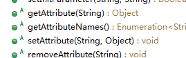
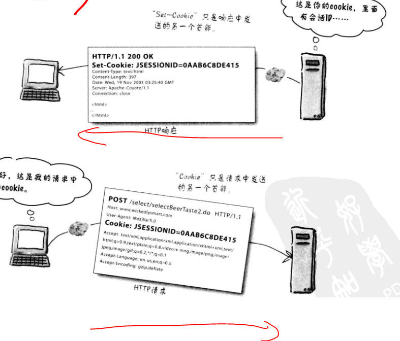
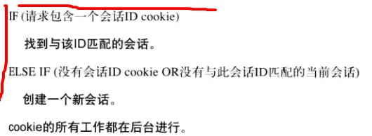
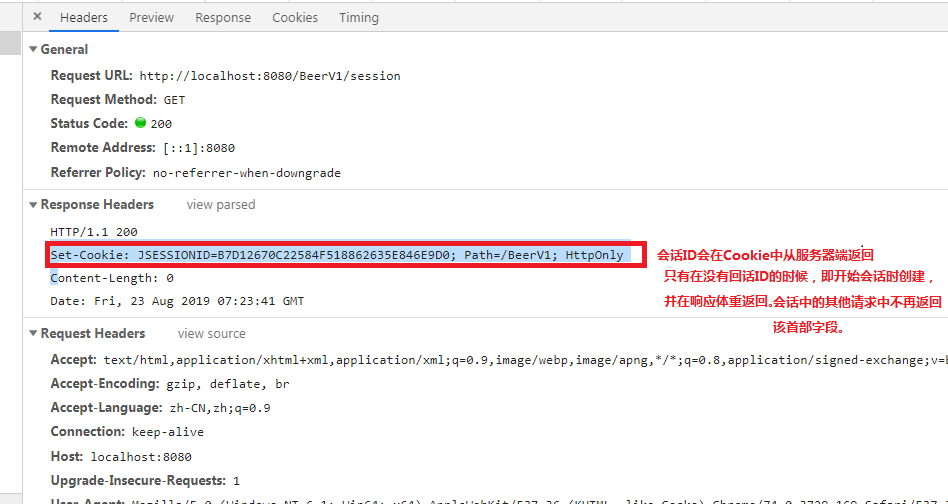
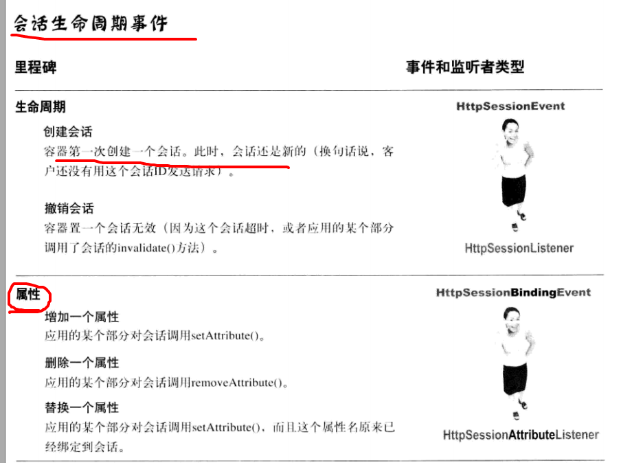
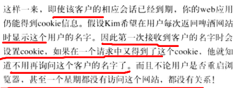
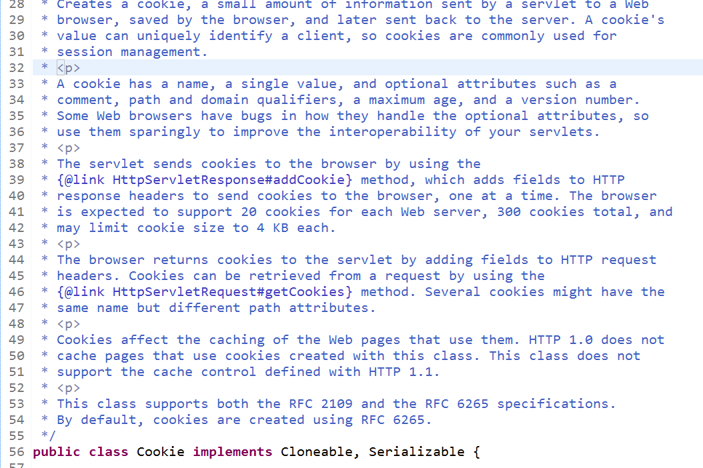
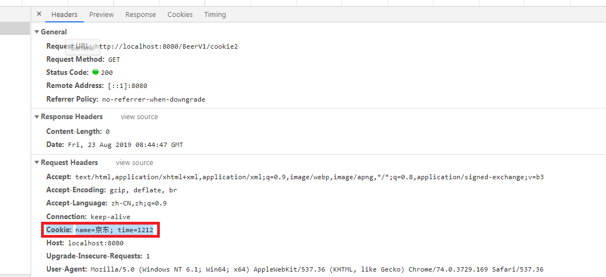

##0、ServletConfig和ServletContext



### 0.1、ServletConfig接口(每一个Servlet的配置）
	
	在Servlet运行期间，经常要要一些辅助信息，例如，文件使用的编码，使用Servlet程序的公司，这些信息可以在web.xml中进行配置。

	当Tomcat初始化一个Servlet时，会将该Servlet的配置信息封装到一个ServletConfig对象中,通过调用init(ServletConfig config)方法将ServletConfig对象传递给Servlet.


* 容器初始化一个Servlet时，会为这个Servlet创建一个唯一的ServletConfig
* 容器从DD中读出“Servlet

**解决硬编码的问题，不用去改动Servlet源代码只需要去修改Web.xml即可**<br>


### 0.2、ServletContext接口（整个应用的配置，全局性）
	
当Servlet容器启动时，会为每个Web应用创建一个唯一的ServletContext对象代表当前Web应用，该对象不仅封装了当前Web的所有信息，而且实现了多个Servlet之间数据的共享。

	 <servlet>
	  	<servlet-name>test</servlet-name>
	  	<servlet-class>com.monkey1024.test.Test</servlet-class>
		
		<!-- Servlet的配置 --->
	  	<init-param>
	  		<param-name>name</param-name>
	  		<param-value>zhoujian</param-value>
	  	</init-param>
	  </servlet>
	  
	  <servlet-mapping>
	  	<servlet-name>test</servlet-name>
	  	<url-pattern>/test</url-pattern>
	  </servlet-mapping>
	  
		<!-- WEb的配置 --->
	  <context-param>
	  		<param-name>address</param-name>
	  		<param-value>shanghai </param-value>
	  </context-param>
  


#### 0.2.1实现多个Serlet对象共享数据
	
		由于一个Web应用中的所有Servlet共享一个ServletContext对象，

	因此ServletContext对象的域属性可以被该该Web应用中的所有Servlet访问。

	在ServletContext接口中定义了分别用于增加、删除、设置ServeltContext域属性的4个方法。




**域属性：**<br>
	
	request对象可以设置attribute：对于每次请求响应都可以设置，具有一次性
	
	ServletContext可以设置域属性: 全局性，但是不能识别不同的客户(会话)


#### 0.2.2 读取Web应用下的资源文件
	
	有时候，希望读取Web应用中的一些资源文件，如配置文件、图片等。

	为此，在ServletContext接口中定义了一些读取Web资源的方法，这些方法是依靠Servlet容器来实现的。


	Serclet容器根据资源文件相对于Web应用的路径，返回关联资源文件的IO.

	  public InputStream getResourceAsStream(String path); //返回映射到某个资源文件的InputStream输入流对象。


	


## 1、会话状态(区分不同用户不同浏览器)

	Web服务器没有短期记忆。
	
	一旦发送了响应，Web服务器就会忘记你是谁。

	下一次再做请求的时候，Web服务器不会认识你。换句话说，它们不记得你曾经做过请求，也不记得它们曾经给你发出响应。什么都不记得了。
	
	有时候这也没有关系，但有时候可能需要跨越多个请求保留与客户的会话状态。

	对于购物车，如果要求客户必须在一个请求中既做出选择右要结账，这是不合适的。

	对此，在Servlet API中可以找到一种极其简单的解决方法。

*HttpServletRequest对象和ServletContext对象都可以进行数据*


**HttpSession对象可以保存跨同一个客户多个请求的会话状态。**<br><br>

**换句话说，与一个特定客户的整个会话期间，HttpSession会持久存储**<br><br>

**对于会话期间客户做的所有请求，从中得到的所有信息都可以用HttpSession对象保存。**<br><br>

	
<font color="red">**HttpSession的特点：**</font><br>
		
	相同的客户
	
	相同的Servlet

	不同的请求
	
	不同的线程

	相同的会话

### 1.1 容器是如何识别客户的
**容器是如何识别客户的？**<br>
<font color="red"> **道理很简单：对客户的第一个请求，容器会生成一个唯一的会话ID,并通过响应把它返还给客户。客户再在以后的每一个请求中发回这个会话ID,容器看到ID后，就会找到匹配的会话，并把这个会话与请求关联。**</font><br>


### 1.2 客户和容器如何交换会话ID信息
**客户和容器如何交换会话ID信息？**<br>
*容器必须以某种方式吧会话ID作为响应的一部分交给客户，而客户必须把会话ID作为请求的一步分发回。最简单而且最常用的方式是通过cookie交换这个会话ID信息。*<br>


### 1.3 创建会话
确实必须告诉容器想创建或使用一个会话，但是除此以外，生成会话ID、创建新的Cookie对象、把会话ID放到Cookie中、把Cookie设置为响应的一部分等等工作都将由容器负责。对于后续的请求，氢气会从请求中的cookie得会话ID，将这个会话ID与一个现有的会话匹配，并把会话与当前请求关联。<br>

**创建会话**<br>

```
	
    /**
     * Returns the current session associated with this request, or if the
     * request does not have a session, creates one.
     *
     * @return the <code>HttpSession</code> associated with this request
     * @see #getSession(boolean)
     */
    public HttpSession getSession();


```





<br>

<font color="red">同一个浏览器打开的多个窗口算一个会话</font><br>
<font color="red">不同浏览器算不同的会话</font><br>
<font color="red">会话的作用为同一个APP下的,同一APP下的Servlet从属于同一个会话 </font><br>


### 1.4 HttpSession接口
**调用getSession()时，关心的只是得到一个实现了HttpSession接口的类的实例。而创建具体的实现是容器的任务**<br>

<font color= "red" size="10px">**大多数情况下，会使用会话来得到和设置会话作用域属性。** </font><br>


### 1.5会话超时
**无需使用方法删除无用的（不活动）会话，这些事情容器会做。**<br>
会话有3种死法：<br>
	
	超时

	在会话对象上调用ibvalidate()

	应用结束（崩溃或取消部署）



## 2 Cookie的其他作用

	尽管原先设计Cookie是为了帮助支持会话状态，不过也可以使用定制Cookie来完成其他工作。

	要记住，cookie实际上就是在客户和服务器之间交换的一小段数据（一个名/值String 对）。服务器把Cookie发送给客户，客户做出下一个请求时再把cookie返回给服务器。

 * Cookie的一大妙处就是，用户不必介入。Cookie交换是自动完成的。
 * <font color="red"> **默认的，cookie与会话的寿命一样长；一旦客户离开浏览器，cookie就会消失。"JSESSIONID" cookie就是如此。但是可以让Cookie活的更长一些，甚至在浏览器已经关闭后仍存活。**</font><br>



### 2.1 利用Servlet API使用Cookie

**相关API: HTTPServletRequest、HttpServletResponse和Cookie.**<br>




		//创建Cookie
		Cookie cookie1 = new Cookie("name", "京东");
		Cookie cookie2 = new Cookie("time", "1212");
		
		//设置cookie在客户端上存货多久，会保存在浏览器设置的本地的某个文件夹中   
		cookie1.setMaxAge(30*60);
		cookie2.setMaxAge(30*60);

		
		//把cookie发送到客户端
		resp.addCookie(cookie1);
		resp.addCookie(cookie2);


		
		//获取请求的Cookie
		Cookie[] cookies = req.getCookies();
		
		//分析Cookie
		for(Cookie cookie:cookies){
			System.out.println(cookie.getName()+"值为:"+cookie.getValue());
		}




**本章主要讲解了Cookie对象和Session对象，其中Cookie对象是早期的会话跟踪技术，它将信息保存到客户端的浏览器中，浏览器访问网站时会携带这些Cookie信息，达到鉴别身份的目的**<br>

**Session是通过Cookie技术实现的，依赖名为 JSessionID的Cookie，它将信息保存在服务器端。Session中能够存储复杂的Java对象，因此使用更为方便。**<br>


