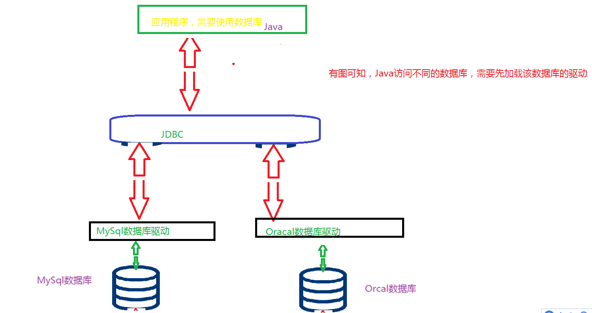
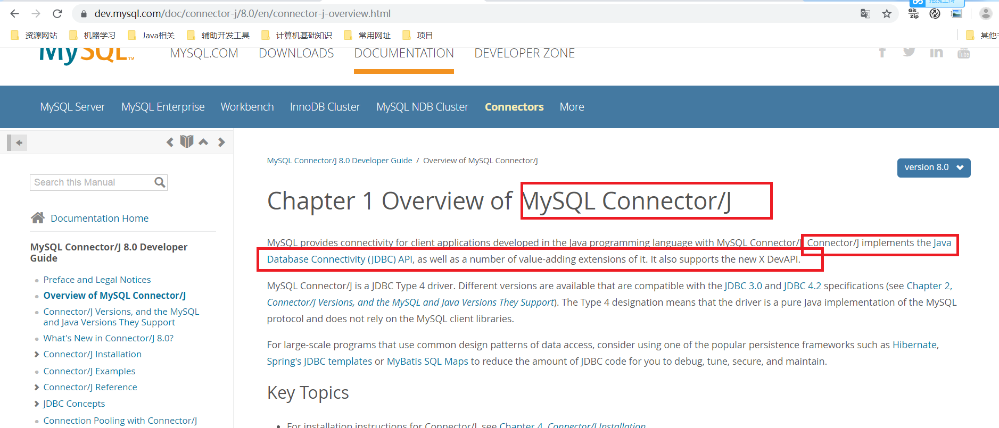
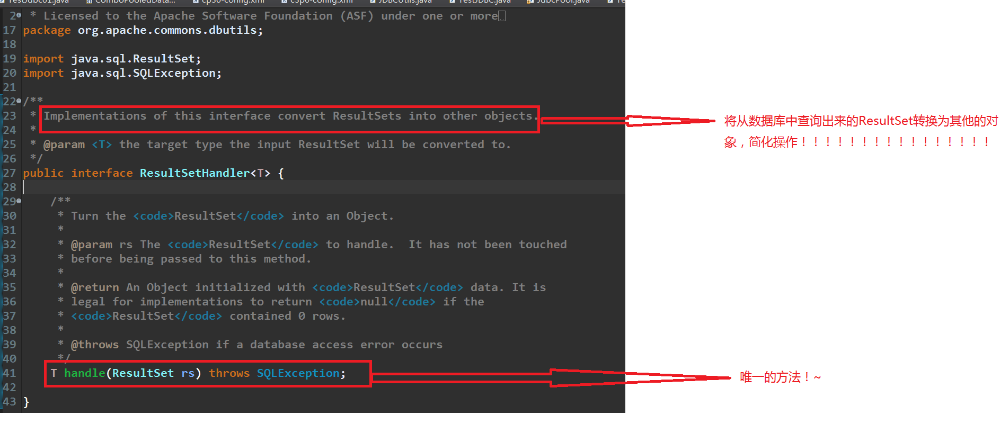

## 0、JDBC入门
### 0.0、什么是JDBC
**jdbc的全程是Java数据库连接（Java Database Connectivity)，它是一套用于执行SQL语句的Java API.应用程序使用JDBC访问数据库的方式如下图：** 

**应用程序可通过这套API练级到关系数据库，并使用SQL语句来完成对数据库中数据的增删改查等操作。** 

下面来看看，在Mysql中实现的JDBC的官网介绍: 

**应用程序使用JDBC访问特定的数据库时，需要与不同的数据库驱动进行连接，由于不同数据库厂商提供的数据库驱动不同，因此，为了使应用程序与数据库真正建立连接，JDBC不仅需要提供访问数据库的API，还需要封装与各种数据库服务器通信的细节。** 

### 0.1、JDBC的使用流程

	//1、加载并注册MySql数据库驱动
		Class.forName("com.mysql.cj.jdbc.Driver");
		
		//2、通过DriverManager获取数据库连接,指定连接的数据库与密码
		Connection conn  = DriverManager.getConnection("jdbc:mysql://localhost:3306/chapter01?useSSL=false&serverTimezone=UTC","root","123456");
		
		//3、通过Connection对象获取Statement对象
		Statement smt = conn.createStatement();
		
		//4、使用Statement执行SQL语句
		String sql = "select * from User";
		ResultSet rs = smt.executeQuery(sql);
		
		//5、操作ResultSet结果集
		while(rs.next()) {
			
			System.out.println(rs.getString("name"));
		}
		//6、关闭资源包括关闭 ResultSet、statement和Connection等资源
		rs.close();
		smt.close();
		conn.close();

	}

### 0.2JDBC常用的API

**Driver**:每个驱动必须继承，之后驱动管理器DriverManager会查找它能查找到的所有驱动，之后进行数据库连接。  

**DriverManager**:管理驱动的类并且创建于数据库的链接（不推荐使用)，NOTE: The DataSource interface, new in the JDBC 2.0 API, provides another way to connect to a data source. The use of a DataSource object is the preferred means of connecting to a data source. 推荐使用**数据源的方法连接到数据库，在C3p0,DBCP等数据源中用的就是，在下一章中介绍。**  

**Connection:代表Java与数据库的链接，可以创建SQL执行语句的对象：Statement、PreparedStatement、CallStatement。**:  

**Statement、PreparedStatement、CallableStatement：代表各种向数据库发送sql语句的借口** 
* Statement:用于向数据库发送SQL语句  
* PreparedStatement:用于执行预编译的SQL语句，常用(?,?,?)  

**ResultSet接口:ResultSet表示SELECT查询语句得到的结果机，该结果集封装在一个逻辑表中，在ResultSet接口内部中有一个指向表格数据行的游标，ResultSet对象初始化时，游标在表格的第一行之前。常用方法：next()、getDate(String columnLabel, Calendar cal) 、getString(String columnLabel) 、**
  

### 0.3、流程详解

(1)**加载并注册数据库驱动** 
	
			Class.forName("com.mysql.cj.jdbc.Driver");
(2)**通过DriverManager获取数据库一个链接：** 

		Connection conn  = DriverManager.getConnection(String url ,String user,String pass);
* url:待链接的数据库  
* user:用户名  
* password：密码  

(3)**通过connection对象获取Statement对象。Connection创建Statement对象的方式有三种：** 
		
		createStatement()：创建基本的Statement对象

		prepareStatement（）：创建PreparedStatement对象

		PrepareCall（）:创建CallableStatement对象

(4)**使用Statement执行SQL语句，所有Statement都有如下三种方法执行SQL语句** 
	
		execute()：可以执行任何SQL语句

		executeQuery():通常执行查询语句，执行后返回代表结果集的ResultSet对象

		
（5）**操作ResultSet结果集：如果执行的SQL语句是查询语句，执行结果将返回一个ResultSet对象，该对象里保存了SQL语句的查询结果。程序可以通过操作该ResultSet对象来取出查询结果。ResultSet对象提供的方法可分为以下两类** 
		
	  ①next、previous、first、beforeFirst、afterLas等移动记录指针的方法
	  ②getXxx()：获取指针指向行，特定列的值

(6)**回收数据库资源：关闭数据库连接、释放资源，关闭ResultSet、Statement、Connection等资源。** 

### 0.4、基础版本JDBC存在的问题
	

为了解决上面的两个问题，提出了数据库池与封装了一些库工具，在接下来的两章中进行下总结。
************************
************************

## 1、JDBC数据库连接池技术
**获取Connection的一种特殊操作** 

**前面,由于每操作一次数据库，都会执行一次创建和断开Connection对象的操作，影响数据库的访问效率，为了解决这个问题，提出了在JDBC实际开发中一个高级操作----数据库连接池**  

### 1.1、什么是数据库连接池‘

**问题** 
*在JDBC编程中，每次断开和断开Connection对象都会消耗一定的时间和IO资源。这是因为在JAVA程序与数据库之间建立程序连接时，数据库段需要验证用户名和密码，并且腰围这个链接分配资源，Java程序则要把代表连接的java.sql.Connection对象加载到内存中，所以建立数据库连接的开销很大，尤其是在大量的并发访问时，假如某网站*  

**解决方案** 
*为了避免频繁的创建数据库连接，工程师门提出了数据库连接池技术。数据库连接池负责分配、管理和释放数据库连接，它允许应用程序重复使用现有的数据库连接，而不是重读建立。* 

**原理** 

### 1.2、DataSource接口
为了获取数据库连接对象，JDBC提供了java.sql.DataSource接口，它负责与数据库建立连接，并定义了返回只Connection对象的方法。 

**接口通常都有其实现类，java.sql.DataSource接口也不例外，人们通常吧实现DataSource接口的类称为数据源，顾名思义即数据的来源。**  

**数据源中包含数据库连接池，一些开源组织提供了数据源的独立实现，常用的有DBCP数据源和C3p0** 

### 1.3 C3P0数据源

**C3p0是目前最流行的开源数据库连接池之一，它实现了DataSource数据源接口。** 
**当使用C3P0数据源时，首先要创建数据源对象，创建数据源对象可以使用ComboPooledDataSource类，该类有两个构造方法  午餐和含参**。
	
		ComboPooledDataSource （）

		
		ComboPooledDataSource（String configName)

###使用C3p0步骤：通过读取配置文件创建数据源对象
**通过ComboPooledDataSource（String configName)构造方法读取c3p0-config.xml配置文件，创建数据源对象，然后获取数据库连接对象，具体步骤如下:**  

(1)**c3p0-config.xml配置文件:**  

		<?xml version="1.0" encoding="UTF-8"?>
	<c3p0-config>
	    <default-config>
	        <property name="driverClass">com.mysql.cj.jdbc.Driver</property>
	        <property name="jdbcUrl">jdbc:mysql://localhost:3306/chapter01?useSSL=false&amp;serverTimezone=UTC</property>
	        <property name="user">root</property>
	        <property name="password">123456</property>
	 
	        <property name="initialPoolSize">10</property>
	        <property name="minPoolSize">10</property>
	        <property name="maxPoolSize">20</property>
	    </default-config>
	 
	    <!-- This app is massive! -->
	   	<named-config name="oracle">
	            <property name="driverClass">com.mysql.cj.jdbc.Driver</property>
	        <property name="jdbcUrl">jdbc:mysql://localhost:3306/chapter01?useSSL=false&amp;serverTimezone=UTC</property>
	        <property name="password">123456</property>
	 
	        <property name="initialPoolSize">10</property>
	        <property name="minPoolSize">10</property>
	        <property name="maxPoolSize">20</property>
	        </named-config> -->
	</c3p0-config>

（2）**使用：获取链接**  

	public class TestC3p02 {
	
	//静态变量
	public static DataSource ds = null;
	
	//使用静态代码快
	static {
		
		
		
		//使用cp30-config.xml配置文件中的name-config节点中name属性
		ComboPooledDataSource cpds = new ComboPooledDataSource("mysql");
	
		ds = cpds;
		
		
	}
	
	
	

	public static void main(String[] args) {
	
		
		try {
			//从连接池中获取连接，之后的操作和正常操作一样
			System.out.println(ds.getConnection());
		} catch (SQLException e) {
			// TODO Auto-generated catch block
			e.printStackTrace();
		}
		
		

	}

}

-------------------------------
---------------------------------

## 3、DBUtils工具

**为了更加简单的使用JDBC,Apache组织提供了一个工具类库commons-dbutils，它是操作数据库的一个组件，实现了对JDBC的简单封装，可以在不影响性能的情况下极大的简化了代码的工作量。**  

### 3.1、常用的API

#### 3.1.1、ResultSetHanler

**ResultSetHandler接口用于处理ResultSet结果集,它可以将结果集中的数据转为不同的形式。根据结果过集中数据类型的不同，ResultSetHandler提供了不同的实现类:**  

	ArrayHandler:把结果集中的第一行数据转成对象数组
	
	ArrayListHandler:把结果集中的每条记录都转为一个对象数组，再将数据组存放到List中
	
	BeanHandler:将结果集中的第一行数据封装到对应的Javabean对象中
	
	BeanListHandler:将结果集中的每一行数据都封装到一个对应的JavaBean实例中，存放到List里。

	
#### 3.1.2、QueryRunner类

**QueryRunner简化了执行SQL语句的代码，它与ResultSetHandler组合在一起能完成大部分的数据库操作，大大减少了编码量。**  
**常用方法**  

1、query(String sql,ResultSetHandler rsh,Object[] params)

* sql:待执行的语句
* rsh:将查询结果处理的结果，减少代码
* params:查询语句的置换参数
**该方法会自动处理PreparedStatement和ResultSet的创建和或关闭**
	
		 /**
		     * Calls query after checking the parameters to ensure nothing is null.
		     * @param conn The connection to use for the query call.
		     * @param closeConn True if the connection should be closed, false otherwise.
		     * @param sql The SQL statement to execute.
		     * @param params An array of query replacement parameters.  Each row in
		     * this array is one set of batch replacement values.
		     * @return The results of the query.
		     * @throws SQLException If there are database or parameter errors.
		     */
	    private <T> T query(Connection conn, boolean closeConn, String sql, ResultSetHandler<T> rsh, Object... params)
	            throws SQLException {
	        if (conn == null) {
	            throw new SQLException("Null connection");
	        }
	
	        if (sql == null) {
	            if (closeConn) {
	                close(conn);
	            }
	            throw new SQLException("Null SQL statement");
	        }
	
	        if (rsh == null) {
	            if (closeConn) {
	                close(conn);
	            }
	            throw new SQLException("Null ResultSetHandler");
	        }
	
	        PreparedStatement stmt = null;
	        ResultSet rs = null;
	        T result = null;
	
	        try {
	            stmt = this.prepareStatement(conn, sql);
	            this.fillStatement(stmt, params);
	            rs = this.wrap(stmt.executeQuery());
	            result = rsh.handle(rs);
	
	        } catch (SQLException e) {
	            this.rethrow(e, sql, params);
	
	        } finally {
	            try {
	                close(rs);
	            } finally {
	                close(stmt);
	                if (closeConn) {
	                    close(conn);
	                }
	            }
	        }
	
	        return result;
	    }

2、query(String sql,ResultSetHandler rsh):该方法用于执行一个不需要置换参数的查询操作  

